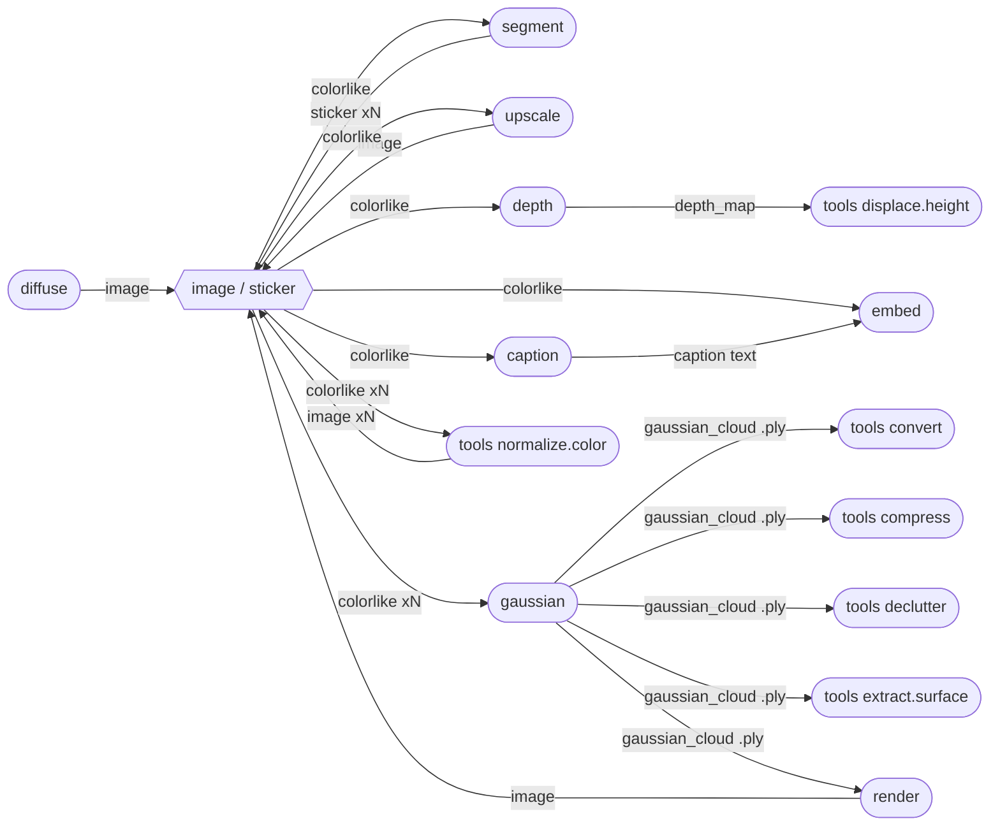

# splat

`splat` is a local 3D image-space toolkit for generating, captioning, embedding, segmenting, upscaling, estimating depth, reconstructing Gaussian splats, rendering them, and transforming Gaussian splat files. It is designed for Apple Silicon first, with MLX, CoreML, PyTorch/MPS, and OpenCV-backed image I/O, and it downloads model weights on demand instead of shipping them in the package.

The CLI is split by behavior:

- **Model-backed stages** live at the top level: `diffuse`, `caption`, `embed`, `segment`, `upscale`, `depth`, `gaussian`, `render`, and `train`. These commands choose a model/runtime or run model optimization, may use substantial compute, and can produce backend-dependent results.
- **Deterministic tools** live under `splat tools`: `convert`, `compress`, `declutter`, `normalize.color`, `displace.height`, and `extract.surface`. These commands are pure transforms for a given input and option set; they do not select models, devices, or licenses.
- **Inspection, services, and administration** stay separate: `info`, `validate`, `manifest`, `models`, `http`, `mcp`, and `env`.

## Getting Started

```sh
git clone https://github.com/daanrongen/splat.git
cd splat
mise install
uv sync
uv run splat --help
```

Install from Homebrew when using a released build:

```sh
brew install daanrongen/splat/splat
```

Check the model catalog and pull weights explicitly:

```sh
splat models list
splat models info sdxl-turbo-mlx
splat models pull sdxl-turbo-mlx
splat models rm sdxl-turbo-mlx
```

## Model-Backed Stages

### diffuse

`splat diffuse` turns a text prompt into an image asset.

```sh
splat diffuse "a small red toy robot, studio lighting" --model sdxl-turbo-mlx -o robot.png
```

Key options: `--model sdxl-turbo-mlx|sd21-coreml`, `--negative`, `--steps`, `--seed`, `--device`, `-o/--output`.

### segment

`splat segment` turns an image asset into RGBA sticker cutouts.

```sh
splat segment robot.png --model sam-mlx --max-stickers 5 -o stickers/
```

Key options: `--model sam-mlx|sam2-coreml`, `--max-stickers`, `--device`, `-o/--output`.

### caption

`splat caption` turns an image or sticker into a UTF-8 text caption asset.

```sh
splat diffuse "dog" | splat caption - --model fastvlm-0.5b -o dog.txt
```

Key options: `--model fastvlm-0.5b`, `--prompt`, `--max-tokens`, `--temperature`, `--device`, `-o/--output`. FastVLM weights are cataloged as research/non-commercial.

### embed

`splat embed` turns an image, sticker, or text string into a normalized `.npy` embedding vector asset.

```sh
splat embed robot.png --model mobileclip2-s0 -o robot.embedding.npy
splat embed --text "red toy robot" --model mobileclip2-s0
```

Key options: `--model mobileclip2-s0`, `--text`, `--device`, `-o/--output`. `mobileclip2-s0` is cataloged as research/non-commercial under Apple's model license. It produces vectors only; search, deduplication, indexes, and retrieval UI are out of scope.

### depth

`splat depth` turns an image or sticker into a depth-map asset stored losslessly as `.npy`, with `-o` writing a normalized preview PNG.

```sh
splat depth stickers/sticker_000.png --model depth-pro -o depth.png
splat depth stickers/sticker_000.png --model depth-anything-v2-coreml -o depth.png
```

Key options: `--model depth-pro|depth-anything-v2-coreml`, `--device`, `-o/--output`. `depth-pro` produces metric depth in meters with a focal-length estimate; `depth-anything-v2-coreml` (Apple's CoreML export of Depth Anything V2 Small) produces relative inverse depth (disparity, higher value = closer) on an arbitrary per-image scale, with no focal length - `tools displace.height` requires a known focal length, so it only works with `depth-pro` output.

### upscale

`splat upscale` turns an image or sticker asset into a higher-resolution image asset with a super-resolution backend.

```sh
splat diffuse "dog" | splat upscale - --factor 4 -o dog-4x.png
```

Key options: `--model realesrgan-mlx`, `--factor 2|4`, `--tile`, `-o/--output`.

### gaussian

`splat gaussian` reconstructs a Gaussian splat from input images. Two backends, and which one you want depends entirely on how many images you have.

**`sharp` (1 image)** is Apple's SHARP: a single feed-forward pass that regresses a metric 3D Gaussian representation from one photograph. This is the backend that makes the headline chain possible, since `diffuse` produces exactly one image.

```sh
splat diffuse "a small red toy robot, studio lighting" | splat gaussian - -o robot.ply
```

About 13 seconds on an M1 Pro for ~1.18M Gaussians. Output is **metric, with absolute scale**, so `gaussian` skips the normalization it applies to every other backend. Because it reconstructs from one viewpoint it recovers the *visible* surface, background plate included, not a full 360-degree object. Weights are `apple/Sharp`, licensed for **research use only**.

**`mlx3d-capture` (3+ images)** is optimization-based rather than feed-forward: it runs structure-from-motion over the inputs to recover poses, then trains a 3DGS scene through MLX/Metal. It needs **3 or more genuinely multi-view-consistent photographs or video frames of one physical scene**. Multiple crops of a single image, or several separately-diffused "front view"/"side view" images, do not satisfy SfM and will fail to register.

```sh
splat gaussian frame-*.png --model mlx3d-capture --quality balanced -o scene.ply
```

Expect minutes, not seconds: 12 views at `--quality balanced` takes roughly 10 minutes on an M1 Pro.

| Option | Default | Purpose |
|---|---|---|
| `--model` | `sharp` | `sharp` (1 image) or `mlx3d-capture` (3+ images) |
| `--device` | `auto` | `auto` \| `cpu` \| `mps` |
| `--quality` | `fast` | mlx3d preset; `balanced` and up train longer |
| `--iters` | preset | Override training iterations |
| `--max-dim` | preset | Max training image dimension |
| `--sh-degree` | preset | Spherical-harmonic degree (0-3) |
| `--poses` | `auto` | `auto` \| `colmap` \| `builtin` \| `existing` |
| `--refine-poses` | `auto` | `auto` \| `on` \| `off` |
| `--low-mem` | off | mlx3d low-memory mode |
| `--seed` | `0` | Random seed; `<0` disables seeding |

`--quality` through `--seed` apply to `mlx3d-capture` only. `sharp` takes `--focal-35mm` (default `30.0`), the 35mm-equivalent focal length assumed for images without EXIF, which sets the absolute scale.

### render

`splat render` renders a `GaussianCloud` to a PNG through Blender, shelling out to `blender --background`. Cycles runs on the Metal GPU; `--engine eevee` is the faster, approximate preview.

Gaussians are rendered the way 3DGS defines them: unlit emission, alpha composited, each kernel carrying its own `exp(-0.5 * m^2)` falloff out to 3 sigma, where `m` is the Mahalanobis distance from the kernel centre to the view ray. There are no lights and no BRDF, so a rendered pixel is the Gaussian's own colour rather than a lighting response. Each kernel is a camera-facing quad whose inverse-covariance basis is evaluated per ray, so the proxy geometry costs two triangles instead of an 80-face sphere.

Because nothing is lit, `--samples` buys anti-aliasing and nothing else: at 1920x1080 a 1.18M-Gaussian frame differs by 0.7% mean absolute error between 16 and 64 samples, for 27s against 82s.

Progress is reported live, including the device it picked and Cycles' first-run kernel compilation, which can take minutes on its own:

```text
render device: Apple M1 Pro (GPU - 16 cores) [METAL]
⠋ Mem: 1M | Loading render kernels (may take a few minutes the first time)
⠹ Remaining: 00:14.54 | Mem: 3143M | Sample 12/64
```

A 1.18M-Gaussian frame at 1920x1080 with 64 samples takes roughly 80 seconds, or 27 with `--samples 16`. If Cycles cannot find a GPU it warns rather than silently falling back to the CPU.

```sh
splat render scene.ply -o scene.png --width 1920 --height 1080 --samples 64
splat render scene.ply -o side.png --azimuth 90 --elevation 10 --look-at 0,0.4,0
```

The viewpoint is spherical around the cloud's robust centre: `--azimuth` (degrees around the up axis, default 25), `--elevation` (degrees above the horizon, default 20), `--distance` (defaults to a fit from the 95th-percentile radius), `--fov` (horizontal degrees), and `--look-at x,y,z` (defaults to the cloud's median point). Clouds are stored Y-up, so azimuth 0 is a head-on view and positive azimuth swings toward +X.

Naming any of those overrides the capture camera. A cloud that carries `capture_camera_*` metadata is otherwise rendered from the pose it was reconstructed from, which for a single-image reconstruction reproduces the input framing.

Key options: `--width` (1280), `--height` (720), `--samples` (32), `--engine cycles|eevee`, `--background` (`black`, `white`, `grey`, `transparent`, or a hex colour), `-o/--output`. Set `SPLAT_BLENDER_BIN` if `blender` is not on `PATH`, and `SPLAT_RENDER_TIMEOUT` to change the 1800s cap (`0` disables it).

`render` always executes locally and is deliberately not part of the `SPLAT_URL` remote surface (see `ports/client.py`).

### train

`splat train` is reserved for per-scene Gaussian splat optimization and is currently a stub.

```sh
splat train dataset/
```

## Deterministic Tools

`splat tools` contains transforms whose output is fully determined by their inputs and options. These commands do not have `--model`, `--device`, model downloads, or model-license warnings.

```sh
splat tools --help
```

### tools convert

`splat tools convert` rewrites Gaussian splat files between registered file formats: `.ply` (lossless), `.splat` (antimatter15's 32-byte-per-point web-viewer format), and `.sog` (a spatially-sorted, image-codec-compressed bundle - see below).

```sh
splat tools convert scene.ply scene.splat
splat tools convert scene.ply -o scene.splat
splat tools convert scene.ply scene.sog
```

Key options: `-f/--from`, `-t/--to`, `-o/--output`.

### tools compress

`splat tools compress` prunes and quantizes a Gaussian splat for a named delivery profile. Since the output format is inferred from the output path (any registered format), writing to `.sog` combines pruning with the much higher compression ratio described below.

```sh
splat tools compress scene.ply scene.web.ply --profile web-delivery
splat tools compress scene.ply scene.web.sog --profile web-delivery
```

Key options: `--profile web-delivery|archival`.

`.sog` (SOG-inspired, #65) is a spatially-sorted, image-codec-compressed bundle: points are reordered along a 3D Morton (Z-order) curve so spatially nearby Gaussians land near each other in raster order, each attribute (position, scale, rotation, SH-degree-0 color/opacity) is packed into an 8/16-bit-per-channel grid, and each grid is PNG-encoded - the sort is what lets PNG's DEFLATE compress far better than on unsorted data. This is a simplified, license-clean take on Self-Organizing Gaussians (SOG, ECCV'24) and PlayCanvas's real `.sog` format: Morton order stands in for PLAS's differentiable grid optimization, and plain PNG stands in for WebP plus per-attribute codebooks - not bit-compatible with either, but on a real 38k-point capture it took a 9.5MB `.ply` down to 535KB (~18x), beating `.splat`'s already-lossy 1.2MB. Higher-order SH is always dropped, like `web-delivery`.

### tools declutter

`splat tools declutter` removes isolated floater Gaussians via neighbor-density outlier detection - a visual-cleanliness pass, distinct from `compress`'s delivery-size pruning.

```sh
splat tools declutter scene.ply scene.clean.ply
```

Key options: `--k` (neighbors considered per point, default 16), `--std-ratio` (outlier threshold in standard deviations, default 2.0).

### tools normalize.color

`splat tools normalize.color` corrects per-view exposure/white-balance drift across a multi-photo capture, ahead of `gaussian` reconstruction, so it doesn't bake into per-Gaussian SH color as spurious view-dependent noise. Matches each image's per-channel mean to the cohort's per-channel median (a gray-world-style gain correction) - the cheapest per-view color-correction model in the appearance-embedding/tone-curve literature, jointly across every image passed in one call.

```sh
splat tools normalize.color capture/*.jpg | splat gaussian -
```

Takes 2 or more image/sticker paths or `@<asset-id>`s and produces one corrected image manifest per input, so it composes with piping like any other pipeline stage.

### tools displace.height

`splat tools displace.height` turns a depth-map asset into a triangulated, textured mesh. It reads the source image through the depth asset's provenance.

```sh
splat depth sticker.png | splat tools displace.height - -o sticker.glb
splat tools displace.height @depth_asset_id -o sticker.obj
```

Key options: `-t/--to glb|obj|ply`, `-o/--output`.

### tools extract.surface

`splat tools extract.surface` extracts a textured triangle mesh from a `GaussianCloud` via screened Poisson surface reconstruction (Kazhdan & Hoppe) over Open3D - Gaussians below `--opacity-threshold` are dropped first (they're usually background/floaters, not surface), remaining means become an oriented point cloud, and low-density Poisson vertices are trimmed to cut the characteristic "bubble" artifact. Output format is inferred from the output path's extension (`.obj`, `.glb`, `.gltf`); `.usdz` isn't supported yet.

```sh
splat tools extract.surface scene.ply scene.glb
splat tools extract.surface scene.ply scene.obj --depth 10 --opacity-threshold 0.2
```

Key options: `-t/--to obj|glb|gltf`, `--depth` (Poisson octree depth, default 9), `--opacity-threshold` (default 0.1).

## Inspection

`info` and `validate` remain top-level debug commands because they inspect data rather than transform it.

```sh
splat info scene.ply
splat validate scene.ply --strict
```

`splat manifest` reads and manages the local manifest cache directly (`~/.cache/splat/manifests` by default) — a manifest already lives wherever it was produced, so this always operates on the local cache rather than routing through `SPLAT_URL`.

```sh
splat manifest list --kind image --created-by diffuse
splat manifest get <id>
splat manifest rm <id>
splat manifest clear --kind image --yes  # prompts for confirmation without --yes
```

## Piping And Manifests

Every stage consumes and produces a `Manifest` — the pipeline's universal currency, and its "one canonical shape every stage consumes and produces, so stages chain without knowing about each other." A `Manifest` is a cached, content-addressed record: `id`, `kind`, `content_path`, typed `metadata` (facts about the content itself), `params` (the stage invocation that produced it), `parent_ids`, `created_by`, plus cache-wide provenance every kind gets for free — `content_size`, `content_sha256`, and `created_at`.

Pipeline commands accept a file path, `@<manifest-id>`, or `-` for NDJSON records from stdin. Every manifest-producing stage writes to the content-addressed cache and prints NDJSON when stdout is piped.

The cache itself sits behind `ManifestRepository` (`ports/manifest_repository.py`), with `FilesystemManifestRepository` as its one adapter today. Besides the `find`/`get`/`put`/`put_external` every stage uses to read and write manifests, it exposes `list` (filter by `kind` or a `created_by` substring, most recent first) and `delete` — the CRUD surface `splat manifest`/`GET /manifests`/`manifest_list` MCP tool sit on top of, documented under Inspection and HTTP Server below.

```sh
splat diffuse "dog" | splat caption - -o dog.txt
splat diffuse "dog" | splat upscale - --factor 2 | splat segment - | splat depth - | splat tools displace.height - -o test.obj
```

`-o/--output` writes a convenient copy to the path you choose; it does not replace the cache entry. Cached manifests keep provenance so downstream tools can retrieve parents, such as `displace.height` loading the image that produced a depth map.

### Kind taxonomy

`ManifestKind` stays a flat set — no class hierarchy — but each kind carries composable capability tags (`domain/manifest.py::KIND_TAGS`), so a stage declares "accepts any color image" once instead of repeating `(image, sticker)` tuples across handlers:

| Kind | Tags | Produced by | On-disk format |
|---|---|---|---|
| `image` | `raster`, `rgb`, `colorlike` | diffuse, upscale | `.png` |
| `sticker` | `raster`, `rgba`, `colorlike` | segment | `.png` |
| `caption` | `text` | caption | `.txt` |
| `embedding` | `vector` | embed | `.npy` |
| `depth_map` | `raster`, `single_channel`, `metric` | depth | `.npy` |
| `shape_3d` | `mesh_3d` | tools displace.height, tools extract.surface | `.glb` / `.obj` |
| `gaussian_cloud` | `splat_3d` | gaussian, render (input) | `.ply` |

Every `gaussian_cloud` splat writes is stored in one canonical convention: **OpenGL-style, +Y up and -Z forward**, recorded in the `.ply` as `coordinate_convention opengl` / `up_axis y`. Reconstruction backends work in OpenCV/COLMAP (+Y down, +Z forward) and declare that, and `run_gaussian` converts on the way in. Storing COLMAP verbatim left every cloud upside down with the camera aimed away from the scene in any Y-up consumer, and `up_axis` could not describe it: COLMAP's up is -Y, which that field's type does not admit.

Every model-backed stage declares what it needs as a `StageContract` (`domain/contracts.py`): named input slots, accepted kinds/tags, and a min/max count, checked by one shared validator instead of ad hoc kind checks. `splat gaussian`'s contract is built per-request from the chosen backend's `required_image_count()` (`sharp` accepts exactly 1, `mlx3d-capture` needs 3+); piping the wrong kind in fails with a message naming both sides:

```
$ splat depth photo.png | splat gaussian -
error: gaussian (mlx3d-capture) requires at least 3 image or sticker, got 1 depth_map. gaussian has no
text-to-3D or depth-only reconstruction path; pipe 3+ image assets of the same scene from different
viewpoints, e.g. `splat gaussian frame-*.png`. To reconstruct from one image, use --model sharp.
```

The single-image suggestion is derived from the catalog, not written into the message, so it names whatever backends actually accept one image.

### Stage flow

Every stage that accepts a "colorlike" manifest (`image` or `sticker`) can consume the output of every stage that produces one — that fan-out/fan-in is what the tag system buys, instead of thirteen separately-remembered producer/consumer pairs:



`tools convert`/`tools compress`/`tools declutter`/`tools extract.surface`/`info`/`validate` sit outside the `Manifest` system by design — they're deterministic file-in/file-out transforms over `GaussianCloud`, not cached pipeline stages. `tools normalize.color` and `tools displace.height` are still cached pipeline stages like any model-backed command — "tools" means "no swappable model catalog," not "no `Manifest`."

## HTTP Server

`splat http` exposes the same work over a trusted-local-network REST API. Requests execute on the machine running the server.

```sh
splat http --host 127.0.0.1:8000
SPLAT_HOST=0.0.0.0:8000 splat http
```

| Route | CLI surface | Response |
|---|---|---|
| `POST /diffuse` | `splat diffuse` | image bytes |
| `POST /caption` | `splat caption` | text bytes |
| `POST /embed` | `splat embed` | embedding `.npy` bytes |
| `POST /segment` | `splat segment` | list of sticker manifest summaries |
| `POST /depth` | `splat depth` | depth `.npy` bytes |
| `POST /upscale` | `splat upscale` | image bytes |
| `POST /gaussian` | `splat gaussian` | Gaussian splat bytes |
| `POST /convert` | `splat tools convert` | converted file bytes |
| `POST /compress` | `splat tools compress` | compressed file bytes |
| `POST /declutter` | `splat tools declutter` | decluttered file bytes |
| `POST /extract-surface` | `splat tools extract.surface` | mesh file bytes |
| `POST /info` | `splat info` | JSON summary |
| `POST /validate` | `splat validate` | JSON summary |
| `GET /assets/{id}` | asset fetch | raw asset bytes |
| `GET /manifests` | `splat manifest list` | list of manifest summaries |
| `GET /manifests/{id}` | `splat manifest get` | full manifest detail |
| `DELETE /manifests/{id}` | `splat manifest rm` | JSON |
| `GET/POST/DELETE /models...` | `splat models list|pull|info|rm` | JSON |

There is no authentication in v1. Bind it only on trusted interfaces or put authentication in front of it.

## Remote Execution

Set `SPLAT_URL` on a client machine to send remote-capable CLI commands to a running `splat http` server. Outputs are written locally, and asset-producing results are mirrored into the local asset cache under the same id.

```sh
# on the compute machine
SPLAT_HOST=0.0.0.0:8000 splat http

# on another machine
SPLAT_URL=http://macbook:8000 splat diffuse "dog" -o test.png
```

`SPLAT_HOST` controls where `splat http` binds. `SPLAT_URL` controls where client commands execute. The two settings are intentionally separate.

## MCP Server

`splat mcp` exposes the same command taxonomy over stdio for MCP clients. Model-backed operations use top-level tool names such as `diffuse`, `caption`, `embed`, `segment`, `upscale`, `depth`, and `gaussian`; deterministic operations use `tools_convert`, `tools_compress`, `tools_declutter`, `tools_normalize_color`, `tools_displace_height`, and `tools_extract_surface`; manifest CRUD uses `manifest_list`, `manifest_get`, and `manifest_delete`.

```sh
splat mcp
```

When `SPLAT_URL` is set, remote-capable MCP tools route through the configured `splat http` server just like the CLI.

## Python SDK

`import splat` gives plain Python callables over the same handlers the CLI and `splat http` use - no subprocess, no argument parsing.

```python
import splat

result = splat.diffuse("a small red boat", steps=4)
stickers = splat.segment(result.asset, max_stickers=5)
caption = splat.caption(result.asset)

pixels = result.asset.as_image()  # numpy RGB/RGBA array
cutout = stickers[0].as_image()  # RGBA sticker
cloud = splat.gaussian(["frame-a.png", "frame-b.png", "frame-c.png"])[0].as_gaussian_cloud()
```

Every function takes a file path, `@<asset-id>`, or a `Manifest` object (or a list of any mix) wherever the CLI accepts `INPUT` positionally, and raises `SplatDomainError`/`ValueError` directly instead of exiting the process. `Manifest.load(id)` fetches a cached manifest by id, and `.as_image()`/`.as_text()`/`.as_array()`/`.as_gaussian_cloud()` decode its content per kind. Setting `SPLAT_URL` redirects remote-capable calls exactly like the CLI - `render()` is the one exception, always executing locally (see `ports/client.py`).

## Environment

Raw model downloads go to `HF_HOME` (`$XDG_CACHE_HOME/huggingface` by default, shared with every other Hugging Face tool on the machine). Splat-specific caches default under `$XDG_CACHE_HOME/splat` or `~/.cache/splat`:

```text
$XDG_CACHE_HOME/splat/
|-- models/     # converted or compiled model artifacts (CoreML, MLX)
`-- manifests/  # pipeline manifest cache, one file per manifest
```

Every command option that can be defaulted from the environment declares it as `SPLAT_<COMMAND>_<PARAM>`, so `splat <command> --help` names the variable next to its own option:

```sh
splat env                    # every setting, its current value, and where it came from
splat env --export           # the same list as a .env template
```

**[`.env.example`](.env.example) is the full reference** and is generated, not hand-written: `splat env --export` walks the Typer commands, so it cannot list a variable the CLI does not honor or omit one it does. Regenerate it with `mise run env-example`; `mise run check` fails if it has drifted.

Copy it to `.env` and uncomment what you want to change. `mise.toml` loads `.env` via `_.file`, so an uncommented line applies to every `splat` run in an activated shell. Outside mise, export the variables yourself or use `uv run --env-file .env splat ...`.

```sh
export SPLAT_DIFFUSE_MODEL=sd21-coreml   # applies to every later `splat diffuse`
```

Precedence is CLI flag, then the environment, then the built-in default. Resolution is Click's own `envvar=` handling against `os.environ`; getting values into `os.environ` is mise's or uv's job, and `splat` does not duplicate it.

Five settings are not command options: `SPLAT_MODEL_CACHE_DIR` and `SPLAT_MANIFEST_CACHE_DIR` (cache roots), `SPLAT_URL` (remote `splat http` base URL), and `SPLAT_BLENDER_BIN` / `SPLAT_RENDER_TIMEOUT` (read directly by the Blender adapter). `SPLAT_CACHE_ROOT` is a `mise.toml` convenience for composing the two cache dirs in local dev; `splat` itself never reads it.

## Architecture

The implementation follows a ports-and-adapters layout with a small transport-neutral handler layer.

| Layer | Role |
|---|---|
| `domain/` | Core value objects such as `GaussianCloud`, `Manifest`, `DepthMap`, contracts, and errors |
| `ports/` | Protocols for model backends, file IO, compression, cache, and client dispatch |
| `application/` | Model-backed use cases and cache-aware orchestration |
| `application/tools/` | Deterministic tool use cases |
| `adapters/` | ML runtimes, file formats, cache implementation, local client, and HTTP client |
| `registry/` | Model and format catalogs plus simple factory wiring |
| `handlers/` | Transport-neutral request handlers for model-backed commands |
| `handlers/tools/` | Transport-neutral request handlers for deterministic tools |
| `cli/` | Top-level Typer commands for model-backed stages and service/debug commands |
| `cli/tools/` | Typer subcommands for deterministic tools |
| `http/` | REST routes that call handlers directly and always execute locally |
| `http/tools/` | REST route modules backed by deterministic tool handlers |
| `mcp/` | MCP stdio tools using the same command taxonomy |

The key boundary is intentional: choosing a model/runtime belongs to top-level model-backed commands; deterministic transforms belong under `tools`; inspection commands stay top-level because they report facts without transforming data.
