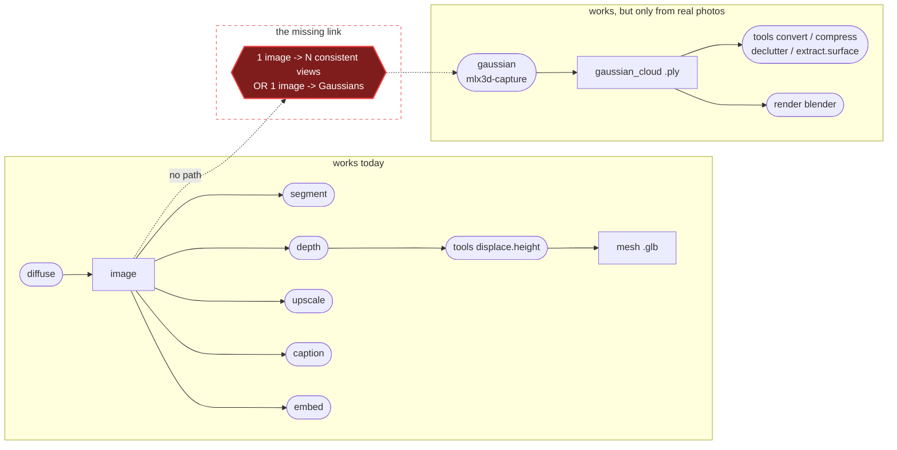

# splat documentation

A live audit of `splat` as it exists at commit `78a6c98` (2026-09-07), written by running every command the CLI exposes against real models on an Apple M1 Pro and recording what actually happened.

| Document | What it covers |
|---|---|
| [architecture.md](architecture.md) | How `splat` is built today: layers, the `Manifest` data model, the format/model catalogs, and the four transports |
| [pipeline.md](pipeline.md) | A live end-to-end walkthrough with real timings, real outputs, and rendered images from every stage |
| [gaps.md](gaps.md) | Every gap and defect found, ranked by severity, each with a reproduction |
| [roadmap.md](roadmap.md) | The research landscape and concrete CoreML/MLX backend proposals to close the `diffuse -> gaussian` gap |

## The one-paragraph summary

`splat`'s skeleton is genuinely good. Ports-and-adapters is real, not decorative: a `GaussianCloud` aggregate sits at the centre of all format and compression work, a `Manifest` DAG carries provenance between stages, and one transport-neutral handler layer feeds a CLI, an HTTP server, an MCP server, and a Python SDK. The deterministic half of the toolkit works and is measurably good, `.ply` to `.sog` really is 18x. The model-backed half is where the promises outrun the implementation, and the `gaussian` -> `render` axis is the worst of it: the only working reconstruction backend needs 3+ genuinely multi-view-consistent photographs, which no other `splat` command can produce, and the renderer draws Gaussians using a surface shading model that a splat is not. The chain the tool advertises, image to Gaussian splat to a presentable render, cannot currently be completed, and the missing piece is a single-image feed-forward reconstruction backend.

## The chain the user wants, and where it breaks

`GAP` is the whole story. Everything left of it works. Everything right of it works if you hand it a real capture. Nothing in `splat` bridges the two.
