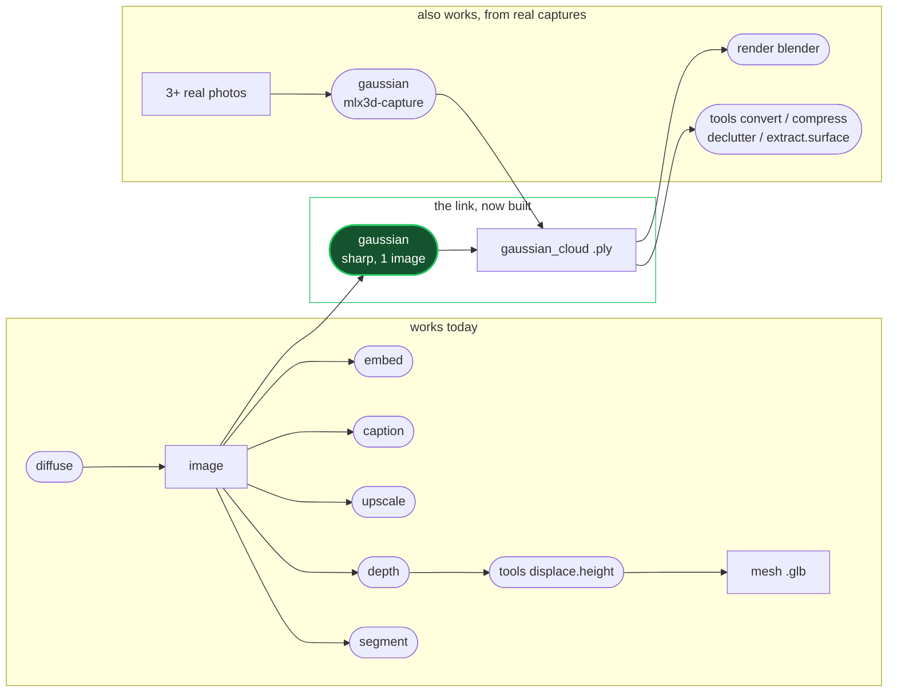

# splat documentation

A live audit of `splat` as it exists at commit `78a6c98` (2026-09-07), written by running every command the CLI exposes against real models on an Apple M1 Pro and recording what actually happened.

| Document | What it covers |
|---|---|
| [architecture.md](architecture.md) | How `splat` is built today: layers, the `Manifest` data model, the format/model catalogs, and the four transports |
| [pipeline.md](pipeline.md) | A live end-to-end walkthrough with real timings, real outputs, and rendered images from every stage |
| [gaps.md](gaps.md) | Every gap and defect found, ranked by severity, each with a reproduction |
| [roadmap.md](roadmap.md) | The research landscape and concrete CoreML/MLX backend proposals to close the `diffuse -> gaussian` gap |

## The one-paragraph summary

`splat`'s skeleton is genuinely good. Ports-and-adapters is real, not decorative: a `GaussianCloud` aggregate sits at the centre of all format and compression work, a `Manifest` DAG carries provenance between stages, and one transport-neutral handler layer feeds a CLI, an HTTP server, an MCP server, and a Python SDK. The deterministic half of the toolkit works and is measurably good, `.ply` to `.sog` really is 18x. The model-backed half is where the promises outrun the implementation, and at the time of the audit the `gaussian` -> `render` axis was the worst of it: the only working reconstruction backend needed 3+ genuinely multi-view-consistent photographs, which no other `splat` command could produce, and the renderer draws Gaussians using a surface shading model that a splat is not. The chain the tool advertises, image to Gaussian splat to a presentable render, could not be completed at all.

**Since the audit,** the single-image backend it identified as the missing piece has landed (`--model sharp`), so the chain now completes in about 28 seconds. The renderer's image-formation model is still wrong, which is what stands between "completes" and "presentable".

## The chain, and where it stands

The gap this audit was written around is closed: `--model sharp` reconstructs from one image, so `diffuse -> gaussian -> render` now completes. What remains is the *quality* of the last step - `render` still draws Gaussians with a surface shading model rather than emissive alpha compositing, which is [gaps.md](gaps.md) G2.
