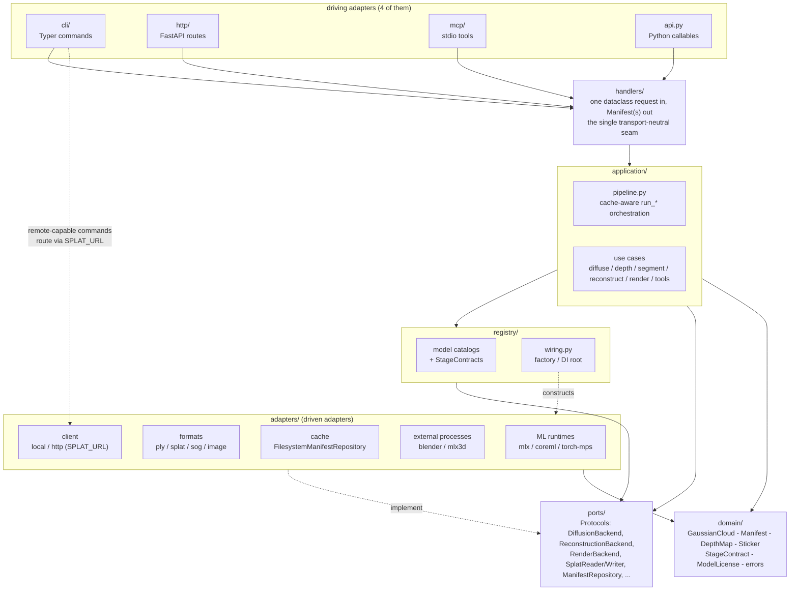
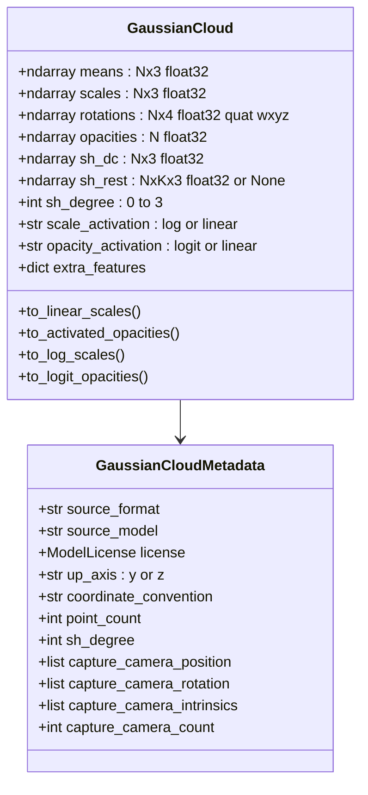
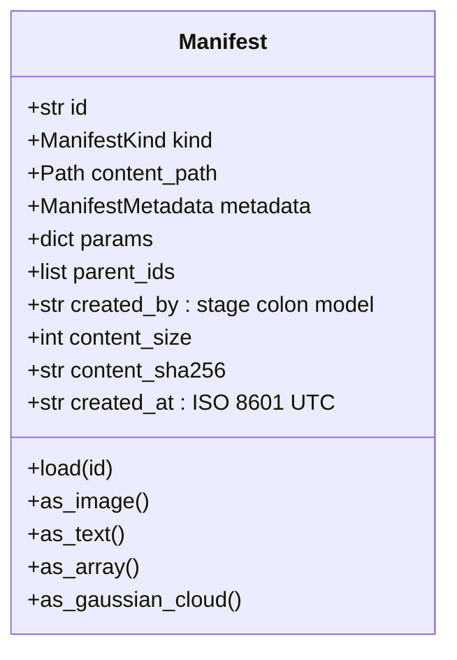
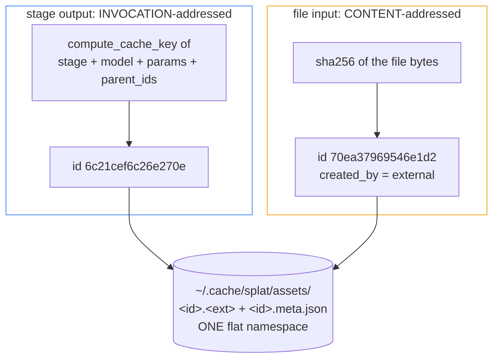
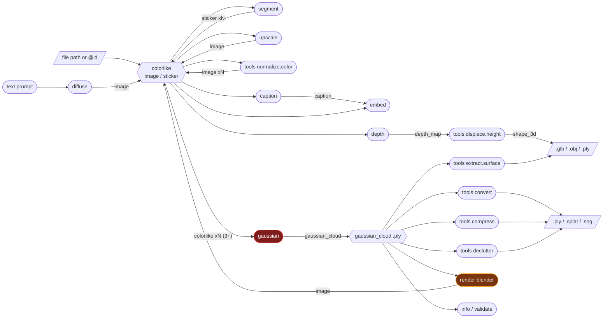

# How `splat` currently works

This describes the code as it is at `78a6c98`, not as the README describes it. Where the two disagree, [gaps.md](gaps.md) records the drift.

## Layering

`splat` is ports-and-adapters with a transport-neutral handler layer in the middle. The dependency rule is that arrows only ever point inward.

The layering is honest. `domain/` imports nothing but numpy. `ports/` are real `Protocol`s. `handlers/` never touches `registry`/`application`/`adapters` from a transport, and every transport calls the same handler. That is the part of this codebase most worth protecting.

## Two data hubs

Everything in `splat` flows through exactly two aggregates. That is the core design decision and it is the right one, it replaces N-squared pairwise converters with two hubs.

### `GaussianCloud` (`domain/gaussians.py`)

The canonical Gaussian aggregate. Every format reader/writer and every compression/cleanup/mesh adapter reads and writes this one type.

Two things this gets right and most codebases get wrong:

- **Activations are not silently normalized on load.** The cloud keeps whatever parameterization the source used and exposes `to_linear_scales()` / `to_activated_opacities()`. Every adapter's `exp`/`sigmoid` handling lives in one place instead of being re-derived per adapter.
- **`__post_init__` validates shapes and finiteness.** A malformed cloud cannot exist.

`normalize_gaussian_cloud()` recenters on the **median** centroid and rescales so the **median** radius is 1.0, deliberately median rather than mean so sparse-SfM floaters do not skew the frame. It correctly transports `capture_camera_position` through the same transform.

### `Manifest` (`domain/manifest.py`)

The pipeline currency. Every model-backed stage consumes and produces one.

`ManifestKind` is a flat `StrEnum`, and `KIND_TAGS` layers composable capability tags on top so a stage declares "accepts any colorlike raster" once instead of repeating `(image, sticker)` tuples across handlers:

| Kind | Tags | Produced by | On disk |
|---|---|---|---|
| `image` | `raster`, `rgb`, `colorlike` | `diffuse`, `upscale`, `tools normalize.color`, `render` | `.png` |
| `sticker` | `raster`, `rgba`, `colorlike` | `segment` | `.png` |
| `caption` | `text` | `caption` | `.txt` |
| `embedding` | `vector` | `embed` | `.npy` |
| `depth_map` | `raster`, `single_channel`, `metric` | `depth` | `.npy` |
| `shape_3d` | `mesh_3d` | `tools displace.height` | `.glb` / `.obj` |
| `gaussian_cloud` | `splat_3d` | `gaussian` | `.ply` |

Flat-enum-plus-tags is the right call. It avoids a rigid subtype tree while still expressing "a sticker is-a colorlike raster", and `domain/contracts.py` builds declarative input validation directly on the tags.

## The cache is two ID schemes in one namespace

This is the most important thing to understand about `splat`'s data model, and the README does not say it.

`FilesystemManifestRepository.put()` takes the id from its caller, and every caller in `application/pipeline.py` passes `compute_cache_key(...)`, a hash of *how the artifact was made*. That gives free memoization: rerun `splat diffuse "dog" --seed 1` and it short-circuits. `put_external()` instead hashes the *bytes*, so uploading the same file twice dedupes.

Both write into one namespace under one `id` field. The consequence, demonstrated in [pipeline.md](pipeline.md), is that the same bytes get two ids and two copies on disk, and provenance forks the moment you feed a stage a file path instead of an `@id`. The `Manifest` docstring holds both claims at once, "A cached, content-addressed artifact. `id` is a deterministic hash of the inputs that produced it", which are different things.

### The fan-out marker

`segment` produces N stickers, so `run_segment` writes N children plus a **zero-byte marker manifest** whose `metadata.children` lists them, so a rerun short-circuits. The marker is stored as `kind=STICKER` with `ext="manifest"`. It is a reasonable mechanism wearing the wrong type: it shows up in `splat manifest list --kind sticker` as a sticker, satisfies any `colorlike` contract, and then fails at decode time.

## Stage flow as actually implemented

Red is broken for the advertised use case, amber is working but producing the wrong image. `render` closing the loop back into `colorlike` is a nice property of the design, a render is just another image manifest and can be captioned, embedded, upscaled, or re-segmented.

## Contracts

`domain/contracts.py` is small and does real work. Each stage declares a `StageContract` with named `Requirement` slots (accepted kinds OR tags, min/max count, plus a "do this instead" hint), and one shared `validate_inputs` checks them. `gaussian`'s contract is built per-request from the chosen backend's `required_image_count()` classmethod, so `mlx3d-capture` advertises `(3, None)` and `sharp` advertises `(1, 1)` without instantiating anything or pulling weights.

The documented limitation is real and self-admitted: every contract has exactly one slot, so there is no way to express "a `gaussian_cloud` **and** a camera pose" or "a `gaussian_cloud` **and** a `sticker` mask". Issue #55 tracks it, and every interesting next feature needs it.

## Model catalogs

Each `registry/<stage>.py` holds a frozen-dataclass descriptor catalog. Catalogs are built at **module import** but the adapter imports happen inside `_build_catalog()`, which was intended to keep an optional dependency from breaking unrelated commands. It does not achieve that, because the module-level `CATALOG = _build_catalog()` runs on import anyway.

| Model | Runtime | License | Status as tested |
|---|---|---|---|
| `sdxl-turbo-mlx` | mlx | StabilityAI-NC-Community (NC) | works, 15s at 512px |
| `sd21-coreml` | coreml | OpenRAIL-M | runs, visibly weaker composition |
| `sam-mlx` | mlx | Apache-2.0 | works, 19s |
| `sam2-coreml` | coreml | Apache-2.0 | **crashes** |
| `depth-pro` | torch/mps | Apple-ASCL | works, 16s, metric + focal length |
| `depth-anything-v2-coreml` | coreml | Apache-2.0 | works, 6s, relative disparity |
| `fastvlm-0.5b` | torch | Apple-ML-Research (NC) | runs, output text polluted |
| `mobileclip2-s0` | torch | Apple-ML-Research (NC) | works, 512-d normalized |
| `realesrgan-mlx` | mlx | BSD-3-Clause | works, 2x and 4x |
| `mlx3d-capture` | mlx | MIT | works from real photos only |
| `sharp` | torch | Apple-ML-Research (NC) | **works**, 1 image -> metric 3DGS, ~13s on MPS |

`ModelLicense` is a genuine strength. It carries `spdx_id` + `is_commercial` + `notes`, is printed as a loud warning at invocation time, and given the Gaussian-splat ecosystem's license minefield (see issue #70) it is the right thing to have built early.

## Formats

`registry/formats.py` maps extension to reader/writer.

| Format | Lossy | Carries | Measured on a 37,946-point cloud |
|---|---|---|---|
| `.ply` | no | full SH 0-3, camera pose in comments | 9,412,505 B |
| `.splat` | yes | SH degree 0 only, 32 B/point | 1,214,272 B (7.8x) |
| `.sog` | yes | SH degree 0, Morton-sorted, PNG-coded grids | 522,533 B (**18.0x**) |

`.sog` is the standout piece of engineering here. Points are reordered along a 3D Morton curve so spatially adjacent Gaussians land adjacent in raster order, each attribute is packed into an 8/16-bit grid, and each grid is PNG-encoded, the sort being what lets DEFLATE work. It is a simplified, license-clean take on Self-Organizing Gaussians, Morton order standing in for PLAS's differentiable grid optimization. It is not bit-compatible with PlayCanvas's `.sog` and the README says so.

## The four transports do not agree

Every transport calls the same handler layer, but nothing enforces that they expose the same *set* of handlers, and they have drifted.

| Operation | CLI | HTTP | MCP | SDK |
|---|:--:|:--:|:--:|:--:|
| `diffuse` / `caption` / `embed` / `segment` / `depth` / `upscale` / `gaussian` | yes | yes | yes | yes |
| `info` / `validate` | yes | yes | yes | yes |
| `tools convert` / `compress` | yes | yes | yes | yes |
| `tools declutter` / `extract.surface` | yes | yes | yes | **no** |
| `tools normalize.color` / `displace.height` | yes | **no** | yes | **no** |
| `render` | yes | **no** | **no** | yes |
| `manifest list/get/rm` | yes | yes | yes | **no** |
| `models list/pull/info/rm` | yes | yes | yes | **no** |
| `train` | stub | no | no | no |
| `mesh` | removed in #57 | never existed | never existed | never existed |

`render` is the notable hole: it is the presentation step, and it is reachable from the CLI and the SDK only. It is also intentionally excluded from `SPLAT_URL` remote dispatch (`ports/client.py`), which is defensible since Blender lives on the machine, but it means the HTTP server cannot render.

## Remote execution and env

`SPLAT_URL` on the client redirects remote-capable commands to a `splat http` server, with results mirrored into the local manifest cache under the same id. `SPLAT_HOST` controls where the server binds. The two are deliberately separate settings, which is correct.

Defaults resolve CLI flag, then `os.environ`, then `mise env --json`, then a built-in default. `splat env` prints every setting with its source. The mechanism is good, the table it prints is a hand-maintained duplicate of the CLI signatures and has already drifted, see [gaps.md](gaps.md).

## Test suite shape

352 tests, 6.7 seconds, 86% line coverage. The distribution matters more than the number:

| Module | Coverage | What that means |
|---|---|---|
| `domain/`, `ports/`, `registry/` | 89-100% | genuinely well covered |
| `adapters/formats/*` | 89-100% | round-trip tested, and it shows, formats are the most reliable part |
| `application/pipeline.py` | 96% | cache-key logic is covered |
| `adapters/mesh/poisson.py` | **100%** | and it hangs indefinitely on real input |
| `adapters/diffuse/coreml_stable_diffusion.py` | 54% | sampler math unexercised |
| `adapters/segment/mlx_sam.py` | 33% | |
| `adapters/segment/coreml_sam2.py` | **17%** | ships a type error on the first inference call |
| `adapters/render/_blender_script.py` | **0%** | 165 statements, the entire image-formation model |

The suite tests the plumbing thoroughly and the payload almost not at all. `poisson.py` at 100% coverage while hanging forever in production is the sharpest illustration: the coverage is over the Python wrapper, never over the behaviour of the call it wraps.
