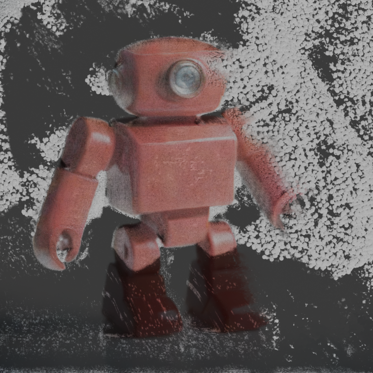

# Gaps and defects

Ranked by how much they block the stated goal: *diffuse an image, chain it to a Gaussian splat, present it nicely in Blender, with well-architected data throughout*. Every entry has a reproduction from [pipeline.md](pipeline.md).

## Tier 0 - blocks the goal outright

### G1. There is no image-to-Gaussian path ~~(closed)~~

> **Closed.** `splat gaussian --model sharp` reconstructs from a single image. `splat diffuse "..." | splat gaussian - --model sharp` runs end to end in about 28 seconds. See [roadmap.md](roadmap.md) "Route A" for the implementation and its measurements. The rest of this entry records what the gap was.

`gaussian` had one working backend, `mlx3d-capture`, which runs SfM plus per-scene 3DGS optimization and needs 3+ genuinely multi-view-consistent photographs. No other `splat` command could produce those. `diffuse` produces one image, and four prompted "views" are four different objects ([pipeline.md §7](pipeline.md)):

```
RuntimeError: No image pairs with enough matches. The images likely do not overlap or lack texture.
```

The other cataloged backend, `mvsplat`, was a deliberate `NotImplementedError` and was also the model the README's `gaussian` example named. Both the stub and the README example are gone.

Worse, the README's own remediation advice was unsound. Piped the wrong kind, `gaussian` printed:

> `gaussian has no text-to-3D or depth-only reconstruction path - pipe image/sticker assets in instead, e.g. splat diffuse ... | splat segment - | splat gaussian -`

That suggested feeding N SAM cutouts of *one* view into a structure-from-motion pipeline. SfM needs multiple *viewpoints*, not multiple crops of one viewpoint. The recommended chain could not work even in principle, and as measured in §3 the first sticker it would feed in is the background plate. The hint now points at `splat gaussian frame-*.png`.

The chain, from one diffused image to a render framed at the capture camera:

| Input, `splat diffuse` | Output, `splat gaussian --model sharp` then `splat render` |
|---|---|
|  |  |

Reconstruction from a single view recovers the *visible* surface, so the white speckle is the studio backdrop reconstructed behind the subject, and the washed-out colour is G2 below, not a reconstruction error.

### G2. `render` uses the wrong image formation model ~~(closed)~~

> **Closed.** `render` now uses emissive alpha compositing with the real 3DGS kernel: no lights, no BRDF, and `alpha = opacity * exp(-0.5 * m^2)` with `m` the Mahalanobis distance from the kernel centre to the view ray, evaluated per ray from an inverse-covariance basis (`_gaussian_axes`). Verified against a single red Gaussian of known sigma at known distance: measured alpha tracks the analytic curve from 0.99 down to 0.04 across five pixel offsets, the frame corners stay untouched at 3 sigma, and the centre pixel is `(1.00, 0.00, 0.00)` - the Gaussian's own colour, not a lighting response. Two further defects surfaced while fixing it, both of which had been reading as reconstruction error: SH DC colours are sRGB display values and were being handed to a linear-light shader, and Cycles' default 8 transparent bounces clipped the accumulation stack. The proxy geometry became a camera-facing quad instead of an 80-face IcoSphere, which is what a rasterizer does anyway and costs 40x less geometry. The rest of this entry records what the gap was.


`_blender_script.py` renders each Gaussian as a lit, opaque, hard-edged IcoSphere under a `Principled BSDF` with `Roughness=0.5` and a `SUN` at `energy=2.5`. 3DGS is emissive volumetric alpha compositing: no lights, no BRDF, no specular, and a `exp(-½r²)` falloff integrated to about 3σ.

Consequences visible in [pipeline.md §9](pipeline.md): colours are a lighting response rather than the Gaussian's own `sh_dc`, the surface reads as glass shards rather than continuous geometry, `subdivisions=1` shows visible facets, and the kernels are roughly 3x too small because a 1σ hard ellipsoid replaces a 3σ soft one.

Fix direction: `ShaderNodeEmission` (or a volume shader) with `Alpha = opacity`, no lights, `scale × ~2.5-3`, higher subdivisions or a billboard-with-Gaussian-texture instancer, and a configurable world background. This is a small, well-scoped change to one 165-statement script that currently has 0% coverage, and it changes every rendered image the tool produces.

### G3. `render` has no camera controls

`--width`, `--height`, `--samples`, `--engine`. That is the whole surface of the presentation command.

- The "real captured camera pose" path (#59/#71) always resolves to the identity rotation, because `_attach_camera_pose` reads `colmap.cameras[0]` and COLMAP's first registered image *defines* the world frame. Every reconstruction in the cache has `capture_camera_rotation = [[1,0,0],[0,1,0],[0,0,1]]`. The feature is structurally a no-op: it means "render from view zero".
- The fallback auto-fit heuristic puts the camera *inside* the cloud: `distance = median_radius * 4.0`, and `normalize_gaussian_cloud` sets the median radius to exactly 1.0 while the cloud reaches 3.8.
- There is no `--azimuth`, `--elevation`, `--distance`, `--fov`, `--look-at`, `--background`, or turntable/`--frames` output.

You cannot currently choose a viewpoint, so you cannot present a splat.

## Tier 1 - broken or destructive

### G4. `sam2-coreml` has never worked

```
TypeError: Image input, 'image' must be of type PIL.Image.Image in the input dict
```

`adapters/segment/coreml_sam2.py:125` passes `resize(read_rgb(path))`, a NumPy array, to a CoreML model whose input is an `imageType`. It fails on the first inference call. The model is cataloged, downloads on demand, and reports `cached` in `splat models list`. Adapter coverage: 17%.

### G5. `tools extract.surface` hangs indefinitely

Killed at 22 minutes; reproduced at 33,953 / 20,000 / 8,000 points. The same Open3D calls in isolation complete in ~2 seconds. Root cause is an OpenMP runtime clash: PyTorch bundles `libomp`, Open3D's Poisson iso-surface extraction is OpenMP-parallel, and importing `torch` first reliably reproduces the deadlock plus an internal error at `FEMTree.IsoSurface.specialized.inl:1463`. `OMP_NUM_THREADS=1` and `KMP_DUPLICATE_LIB_OK=TRUE` do not help. `splat`'s CLI always imports torch because `registry/*.py` builds every catalog at import.

Fix directions, in order of value: run Poisson in a subprocess with a timeout (the same shape `render` already uses for Blender); derive per-Gaussian normals from the rotation matrix's shortest axis instead of `estimate_normals` + `orient_normals_consistent_tangent_plane`, which is both faster and more accurate for splats; make catalog construction genuinely lazy so `tools` never imports torch; add progress output.

### G6. `tools convert` corrupts `coordinate_convention`

Converting `.ply` to `.splat`/`.sog` relabels the convention from `colmap` to `opengl` **without transforming any coordinates** - the bounding boxes are byte-identical. `adapters/render/blender.py` reads that label to decide whether to apply the COLMAP-to-Blender axis flip, so a converted-and-reloaded cloud renders upside down. Either transform the coordinates or preserve the label; silently relabelling is the one option that is always wrong.

### G7. `tools compress` destroys camera provenance

`PruneQuantizeCompressor.compress` rebuilds `GaussianCloudMetadata` with five fields and drops `capture_camera_position`, `capture_camera_rotation`, `capture_camera_intrinsics`, and `capture_camera_count`. `declutter`, which does the same kind of point-subset operation, preserves them. A `dataclasses.replace` on the source metadata would fix it.

### G8. `--profile archival` is the identity transform

`opacity_threshold=0.0, outlier_std=None, quantize_fp16=False, drop_sh_rest=False`. It copies the file 312 bytes smaller and strips the camera metadata en route. Either give it real behaviour (lossless SH re-ordering, `zstd`-style container, deduplicating near-identical Gaussians) or remove the profile.

### G9. `caption` output is unstripped chat scaffolding

The cached `.txt` asset contains the answer, then `<end of detailed answer>`, then the answer again, then a mid-word truncation. `metadata.text_length=164` counts all of it. Anything that consumes captions (notably `embed`) consumes the noise.

### G10. Third-party exceptions escape as tracebacks

The handler layer catches `SplatDomainError` only, and no adapter translates its backend's exceptions. So `mlx3d`'s `RuntimeError`, coremltools' `TypeError`, and `plyfile`'s `PlyHeaderParseError` all reach the user as raw Rich tracebacks. Adapters are the correct boundary for this: wrap backend calls and raise `ReconstructionBackendError` / `SegmentationBackendError` / `UnsupportedFormat`.

### G11. `render` bypasses the format registry

`application/pipeline.py:468` hardcodes `PlyReader()`. It is the only call site that does not use `registry.wiring.get_reader(suffix)`, so `splat render scene.sog` dies with `PlyHeaderParseError` while `splat info scene.sog` works. One-line fix. (`adapters/client/http.py:332` hardcodes `get_reader(".ply")` similarly.)

## Tier 2 - data architecture

### G12. The cache has two ID schemes in one namespace

`put()` takes an **invocation** hash from `compute_cache_key(stage, model, params, parents)`. `put_external()` takes a **content** hash of the bytes. Both write to one flat namespace under one `id` field. Measured in [pipeline.md §11](pipeline.md): the same bytes got ids `6c21cef6c26e270e` and `70ea37969546e1d2`, two copies on disk, and every downstream stage chained from the `external` clone, orphaning the prompt/seed/model that produced the image.

This bites in exactly the workflow the README teaches (`-o` a file, then use the file). The `content_sha256` needed to fix it is already stored on every manifest and never consulted for lookup.

The cleanest resolution keeps both concepts and stops conflating them: `id` stays the invocation key (memoization), a `content_sha256` index resolves bytes to the manifest that already holds them, and `put_external` returns that manifest instead of minting a clone. The `Manifest` docstring, which currently claims both "content-addressed" and "hash of the inputs that produced it" in two consecutive sentences, should say which one it is.

### G13. `params` records raw CLI input, not the effective invocation

Every `diffuse` manifest in this audit shows `"steps": null`, though sdxl-turbo used 2 and sd21-coreml used 25. Because `params` is *in the cache key*, `--steps 2` and a defaulted 2 hash differently and recompute identical work. `--device auto` versus `--device mps` does the same. Backends should return their resolved parameters and the pipeline should key and record those.

### G14. `depth_map` cannot express metric versus relative

`depth-pro` returns metric metres with a focal length; `depth-anything-v2-coreml` returns relative inverse disparity with **inverted polarity** and no focal length. Both are `kind=depth_map`, whose `KIND_TAGS` entry claims the tag `metric`. The two `-o` previews are inverted relative to each other. Nothing downstream can distinguish them; `displace.height` only rejects the relative one by accident, because it needs a focal length for a different reason.

Fix: split the tag into `metric_depth` versus `relative_disparity`, or add an explicit `DepthMetadata.units` field, and make consumers require the one they can handle.

### G15. The fan-out marker is typed as a sticker

The zero-byte `segment` marker is `kind=STICKER, ext="manifest"`. It appears in `manifest list --kind sticker`, satisfies any `colorlike` contract, loads a full DepthPro checkpoint, and then fails at decode. It needs its own kind (or to live outside the manifest namespace as an index).

### G16. Domain value objects sit unused while adapters hand-roll

`domain/value_objects.py` defines `Camera`, `Pose`, `convention_flip_matrix`, `_CONVENTION_FLIPS`, and `UNCONFIRMED`. Grep count of uses outside that file: **zero**. Meanwhile `GaussianCloudMetadata` stores camera pose as `list[float]` / `list[list[float]]`, and `adapters/render/blender.py` hand-rolls `_COLMAP_TO_BLENDER_FLIP` plus its own `_convert_camera_rotation`.

This is the clearest instance of a general pattern: the domain is a little bit aspirational and the adapters quietly do their own thing. Either use `Camera`/`Pose` in `GaussianCloudMetadata` and route the flip through `convention_flip_matrix`, or delete the dead code. The first is better, it is the difference between camera data being modelled and being nested lists.

### G17. `up_axis` and `coordinate_convention` contradict each other ~~(closed)~~

> **Closed.** Clouds are now stored in one canonical OpenGL-style frame (+Y up, -Z forward) with `up_axis y` recorded truthfully. Backends declare the frame they produce and `run_gaussian` converts.

`run_gaussian` set `coordinate_convention = "colmap"` and left `up_axis` at the PLY reader's `"y"` default. COLMAP/OpenCV is +Y **down**. Two fields set three lines apart disagreed, and `up_axis`'s type (`Literal["y", "z"]`) could not express COLMAP's -Y up even in principle.

Reported symptom, which is what made this concrete rather than cosmetic: a SHARP cloud opened in a third-party viewer was **upside down with the camera pointing away from the scene**. Both follow from the same cause. COLMAP puts the scene at +Z while a default OpenGL-style camera looks down -Z, so it faced exactly the wrong way; and +Y down renders inverted anywhere Y-up is assumed. Verified on the data rather than by eye - in the stored cloud the brightest 3% of Gaussians (the sky) sat at negative Y:

```
COLMAP y<0 ("up"):   mean luminance 0.378     <- sky and canopy
COLMAP y>0 ("down"): mean luminance 0.314
source image top third 0.355, bottom third 0.289
```

After conversion, +Y is the brighter half and Z spans -218..-1.9, so a viewer's default camera points at the scene. `splat render` produces a byte-comparable image either way, since it was already flipping COLMAP clouds itself and now skips that step.

### G18. `capture_camera_count` records a silent quality failure and nobody looks

Twelve orbit views in, `capture_camera_count: 3` out. SfM dropped 9 views and trained on 3, and the only trace is a metadata field nothing reads. A reconstruction that registered 25% of its input is not a reconstruction. `gaussian` should warn loudly (and probably fail under a `--strict`-style flag) when `registered / len(images)` falls below a threshold, and `splat info` should print it.

### G19. `info` reports almost nothing it has

`splat info` prints format, points, SH degree, bbox, and file size. It has, in hand, `coordinate_convention`, `up_axis`, `source_model`, `license`, all four `capture_camera_*` fields, and could trivially compute opacity and scale distributions, which are what actually tell you whether a cloud is healthy. `license=None` also shows that provenance is dropped between the model descriptor and the cloud in the first place.

## Tier 3 - surface consistency and hygiene

### G20. README documents a command that was deleted

PR #57 removed `splat mesh`. The README still has a `### mesh` section with usage, lists `mesh` among top-level stages, includes it in the stage-flow mermaid diagram, credits it in the kind-taxonomy table, lists `POST /mesh` in the HTTP route table, and names `mesh` as an MCP tool. None of those exist. Meanwhile `splat render` has **no README section at all**, is absent from the intro list, and is missing from the HTTP table.

### G21. `splat env` prints a wrong default ~~(closed)~~

> **Closed.** `splat env` now walks the Typer commands, so the table it prints cannot claim a setting the CLI does not honor. It also turned out the wrong default was the smaller half of the problem, see below.

`gaussian --model` was reported as `mvsplat`; the actual CLI default is `mlx3d-capture`. `cli/env.py` maintained a hand-written default table separate from the Typer signatures. It also omitted `render` (all four options), `caption`, `embed`, `tools convert`/`declutter`/`normalize.color`/`extract.surface`, and seven of `gaussian`'s nine flags.

The larger finding, missed by this audit and caught while fixing it: **fourteen of the sixteen variables the table listed did nothing at all.** No `typer.Option` in the codebase declared `envvar=`, so nothing ever read them:

```
$ SPLAT_DIFFUSE_MODEL=sd21-coreml splat diffuse --help
--model  <str>  [default: sdxl-turbo-mlx]        # unchanged
```

Only `SPLAT_HOST`, `SPLAT_URL` and the two cache dirs worked. 43 command options now declare `envvar=`, each named in its own `--help`, and `splat env --export` generates the committed `.env.example` from the same walk. `splat/env.py`'s parallel `mise env --json` resolution was deleted rather than extended: Click reads `os.environ`, and putting values there is mise's job or uv's.

`.env.example` and `mise.local.toml.example` were both stale hand-written subsets of this, the latter still listing `SPLAT_MESH_*` and `SPLAT_TRAIN_*` for commands that do not exist. One generated file replaces both.

### G22. The four transports expose four different surfaces

See the matrix in [architecture.md](architecture.md). `render` is CLI+SDK only; `tools normalize.color`/`displace.height` are CLI+MCP only; the SDK lacks `declutter`, `extract.surface`, `normalize_color`, `displace_height`, and all manifest/model admin. Nothing enforces parity. A single declarative operation table that each transport enumerates would make drift impossible rather than merely discouraged.

### G23. `models list` cannot distinguish "downloaded" from "works"

`sam2-coreml` reports `cached` and crashes on its first inference call. `cached` means "weights are on disk", nothing more. `mvsplat` had the same problem and has since been removed from the catalog rather than left reporting `cached` for a `NotImplementedError`; `splat models prune` now exists to reclaim weights the catalog no longer references, which is the disk-side half of the same issue. A `status` column (`ready` / `untested`) would carry the meaning `cached` cannot.

### G24. `--steps` and other backend params are not exposed

`DiffusionBackend.diffuse` accepts `cfg_weight`; no transport exposes it. `gaussian`'s nine flags are undocumented in the README. `mlx3d-capture`'s docstring and error message still claim `mlx3d[capture]` is an optional dependency, though it is a hard dependency in `pyproject.toml`.

### G25. Long operations run silently

`mlx3d-capture` is passed `log=lambda _msg: None`, so all SfM and training narration is suppressed; the only reason a progress bar appears at all is that mlx3d writes tqdm to stderr directly. `extract.surface` and `render` print nothing for their whole duration. Blender's log is captured and discarded on success, so there is no way to confirm from `splat` which device rendered. `subprocess.run` has no `timeout` in either external-process adapter.

### G26. `-o` does not create parent directories

`splat diffuse "..." -o some/missing/dir/x.png` runs the full generation, then dies with a raw `FileNotFoundError` traceback. `segment -o dir/` creates its directory. Every `-o` should `mkdir(parents=True)` and the path should be validated before the compute, not after.

### G27. Tests cover the plumbing, not the payload

352 tests, 86% coverage, 6.7s. But `_blender_script.py` is at 0%, `coreml_sam2.py` at 17%, `mlx_sam.py` at 33%, `mlx_stable_diffusion.py` at 35%, `coreml_stable_diffusion.py` at 54% - and `poisson.py` is at **100%** while hanging forever in production. Every defect in Tiers 0-1 lives in exactly the code the suite does not exercise.

What is missing is a slow, opt-in integration tier: one marker (`@pytest.mark.integration`), excluded from `mise run check`, that actually loads each cataloged backend and runs one inference on a tiny input. `sam2-coreml` would have failed on day one. Paired with a golden-image test for `_blender_script.py` (render 100 known Gaussians, compare to a committed PNG within tolerance), that closes the gap that produced most of this list.

### G28. `.splat/` was not gitignored

Added in this audit. Also relevant to issue #34: `__pycache__` still accumulates under `src/` and `tests/` after a test run.
