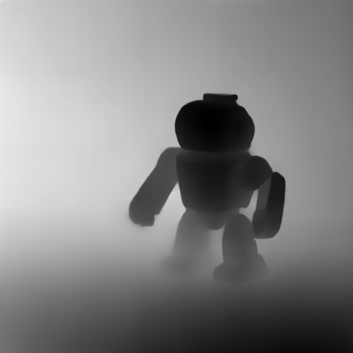
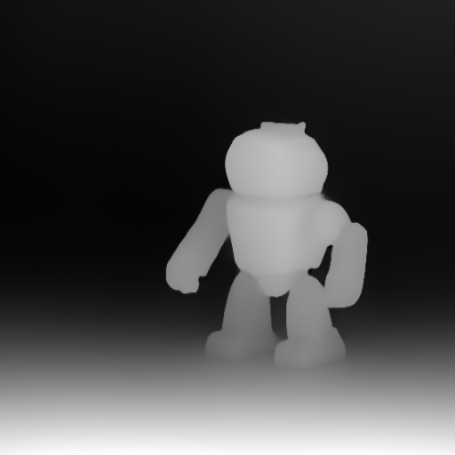
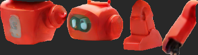
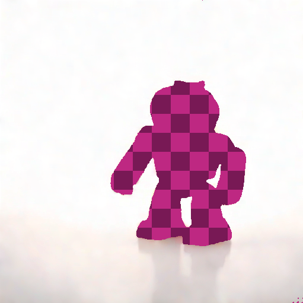
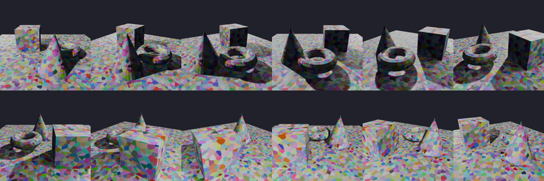
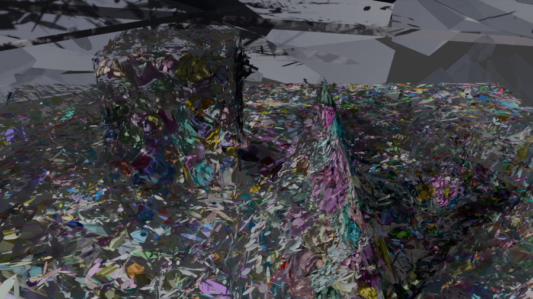
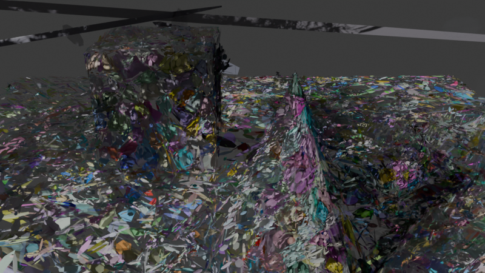
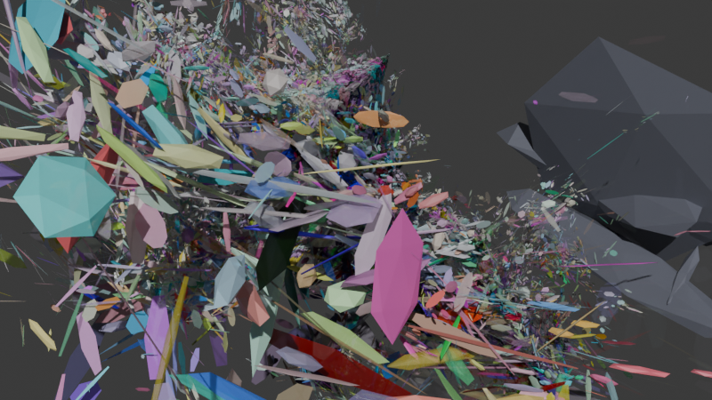

# Live pipeline walkthrough

Every command below was actually run on an Apple M1 Pro (16-core GPU, macOS 25.6, Blender 5.2.1 LTS) against real downloaded weights. Timings are wall clock. Every image is the real output, copied unmodified from the cache.

Scratch outputs live in `.splat/` (gitignored); the images referenced here are copied into `docs/images/`.

## 1. `diffuse` - text to image

```sh
splat diffuse "a small red toy robot on a white table, studio lighting, product photo" \
  --model sdxl-turbo-mlx --seed 42 -o .splat/out/robot.png
```

`15.3s`, 512x512. The pipeline's origin stage, and the best-working model-backed command in the tool.


The same prompt and seed through the other backend:

```sh
splat diffuse "..." --model sd21-coreml --seed 42 -o .splat/out/robot_sd21.png
```

`31.7s`, 2x slower and visibly weaker, subject pushed out of frame:


`sd21-coreml` is a hand-written NumPy port of the MLX Euler sampler driving Apple's three CoreML `.mlpackage` files directly. The sampler math matches the vendored MLX reference line for line, so this is more likely SD2.1-base at 25 steps than a broken port, but the adapter is at 54% coverage with no numerical test against a reference implementation, so that cannot be asserted. Note also that both manifests record `"steps": null` rather than the effective step count each backend actually used (2 for turbo, 25 for CoreML).

The NDJSON record printed on a piped stdout is the manifest:

```json
{"id": "6c21cef6c26e270e", "kind": "image",
 "path": "~/.cache/splat/assets/6c21cef6c26e270e.png",
 "metadata": {"output_width": 512, "output_height": 512},
 "params": {"negative_prompt": "", "prompt": "a small red toy robot...", "seed": 42, "steps": null},
 "parent_ids": [], "created_by": "diffuse:sdxl-turbo-mlx"}
```

## 2. `depth` - image to depth map

Both backends, same input:

```sh
splat depth .splat/out/robot.png --model depth-pro                -o .splat/out/robot_depthpro.png   # 15.7s
splat depth .splat/out/robot.png --model depth-anything-v2-coreml -o .splat/out/robot_dav2.png       # 5.7s
```

| | `depth-pro` | `depth-anything-v2-coreml` |
|---|---|---|
| time | 15.7s | **5.7s** |
| `focal_length_px` | 1611.0 | `null` |
| `field_of_view_deg` | 18.06 | `null` |
| semantics | metric depth, metres | relative inverse depth (disparity) |
| polarity | near = **low** | near = **high** |




The two previews are **inverted relative to each other**, and both are stored under `kind=depth_map`, whose `KIND_TAGS` entry claims the tag `metric`. That tag is true for one backend and false for the other, and nothing in the type system can tell them apart. The only thing that saves the downstream consumer is that `tools displace.height` happens to require a focal length:

```
$ splat tools displace.height @d0139a45278a3971 -o out.glb
error: displace.height requires a depth map with a known focal length.
```

That is a clean domain error, and it is an accident of a different requirement rather than a check on depth semantics.

## 3. `segment` - image to RGBA stickers

```sh
splat segment .splat/out/robot.png --model sam-mlx --max-stickers 5 -o .splat/out/stickers_sam/
```

`19.4s`, 5 stickers. Parts 001-004 composited on grey:



Sticker quality is good. Ranking is not. The top-scored sticker (`score=1.022`, `area=223749`, `bbox=[0,0,511,511]`) is the **background**, with the robot cut out as a hole:



*(magenta checkerboard = transparent alpha; the subject is the hole)*

So `splat segment X | splat gaussian -` (the chain the README recommends when you pipe the wrong kind into `gaussian`) feeds a hole-shaped background plate in as view number one. There is no whole-object mask anywhere in the output, and no `--min-area` / `--max-area-fraction` / foreground bias to get one.

The second backend does not run at all:

```
$ splat segment .splat/out/robot.png --model sam2-coreml --max-stickers 5
TypeError: Image input, 'image' must be of type PIL.Image.Image in the input dict
```

`adapters/segment/coreml_sam2.py:125` passes a NumPy array to a CoreML model whose input is declared as an `imageType`. It fails on the very first inference call, which means this backend has never worked. It is cataloged, it downloads, and `splat models list` reports it `cached`. Adapter coverage is 17%.

### The fan-out marker leaks

`segment` also writes a zero-byte marker manifest recording the fan-out. It is typed `sticker`:

```
$ splat manifest list --kind sticker
e1824f1a74c8f830       sticker   segment:sam-mlx     <- 0 bytes, .manifest
e1824f1a74c8f830-004   sticker   segment:sam-mlx
...
$ splat depth @e1824f1a74c8f830
error: Could not read image '~/.cache/splat/assets/e1824f1a74c8f830.manifest'
```

Contract validation passes (`kind=sticker` satisfies `colorlike`), the full DepthPro checkpoint loads, *then* it fails at decode.

## 4. `caption` and `embed`

```sh
splat caption .splat/out/robot.png --model fastvlm-0.5b -o .splat/out/robot.txt
```

The cached caption asset contains:

```
A red robot toy with a silver faceplate that says "G" on it.
<end of detailed answer>
Answer: A red robot toy with a silver faceplate that says "G" on it.
Answer: A
```

The first line is correct and good. Everything after it is unstripped chat-template scaffolding: a leaked special token, a duplicated answer, and a truncation at `max_tokens=80` mid-word. `metadata.text_length` records 164 characters as if all of it were the caption, and a downstream `splat embed` would embed all of it.

```sh
splat embed .splat/out/robot.png --model mobileclip2-s0    # 512-d float32, normalized
splat embed --text "red toy robot" --model mobileclip2-s0  # 512-d, records text_sha256
```

Both correct. `embed` has the best metadata of any stage: `input_type`, `dtype`, `shape`, `dimension`, `normalized`, `model`, `text_sha256`, `text_length`. This is what the other stages' metadata should look like.

## 5. `upscale`

```sh
splat upscale .splat/out/robot.png --factor 2   # 512 -> 1024, variant RealESRGAN_x2plus
splat upscale .splat/out/robot.png --factor 4   # 512 -> 2048, variant RealESRGAN_x4plus
```

Works, and correctly records `variant`, `source_width/height`, and `output_width/height` in metadata. Another good provenance example.

## 6. `tools displace.height` - the deterministic 2.5D path

```sh
splat tools displace.height @14b81e22f24be5c5 -o .splat/out/robot_displace.glb
```

Works from `depth-pro` output. It resolves the source image through the depth manifest's `parent_ids`, which is exactly what the provenance DAG is for, and the nicest use of it in the codebase.

Output: `262,144` vertices (= 512x512, one per pixel), `519,612` faces, an `11.5 MB` `.glb`. There is no decimation, no `--stride`, and no vertex budget, so a 2048px input would produce 4.2M vertices.

## 7. `gaussian` - where it falls apart

### The chain that is advertised

```sh
splat diffuse "... front view" ; "... side view from the left" ; "... three quarter view from the right" ; "... back view"
```


Four *different robots*, not four views of one robot. Prompt-conditioned diffusion has no cross-view 3D consistency, so:

```
$ splat gaussian .splat/out/mv/*.png --model mlx3d-capture -o out.ply
RuntimeError: No image pairs with enough matches. The images likely do not overlap or lack texture.
```

Two problems in one line. The reconstruction is impossible, which is the real gap. And a third-party `RuntimeError` escapes as a raw Rich traceback instead of a `SplatDomainError`, because the handler layer only catches `SplatDomainError` and no adapter translates its backend's exceptions.

`mvsplat`, the model the README's `gaussian` example named at the time, raised `NotImplementedError` by design; it has since been removed from the catalog and `--model sharp` fills the single-image slot.

### What working input looks like

`mlx3d-capture` needs genuinely multi-view-consistent frames. The manifest cache still held a synthetic Blender orbit (12 x 640px, Voronoi-textured primitives) from an earlier session, addressable by id, so the reconstruction could be re-run entirely through the CLI:



```sh
splat gaussian @9665c6ab5454fa54 @f54ae24c3857cde6 ... (12 ids) --quality balanced --seed 11 -o .splat/out/scene.ply
```

`9m43s`. 7000 training iterations at 11.5-12.1 it/s. Result: **37,946 points, SH degree 3**.

And the buried headline in the metadata:

```
capture_camera_count:      3
capture_camera_rotation:   [[1,0,0],[0,1,0],[0,0,1]]
capture_camera_intrinsics: [600.56, 600.56, 320, 320, 640, 640]
bounding box:              [-15.83, -6.83, -2.60] .. [4.80, 4.02, 7.11]
```

- **3 of 12 input images registered.** SfM dropped 9 views and the pipeline trained on 3, silently. The number is recorded in metadata and never surfaced, warned about, or checked. Nine of twelve views discarded is the difference between a reconstruction and a memorized triplet, and the training loss reaching `0.0057` is overfitting to three views, not quality.
- **The camera rotation is the identity matrix.** It is always the identity matrix, in every reconstruction in the cache. `_attach_camera_pose` takes `colmap.cameras[0]`, and COLMAP's first registered image *defines* the world frame, so its rotation is `I` by construction. The "round-trip the real captured camera pose" feature (#59, #71) resolves to "always render from view zero".
- **The bounding box spans 20 units on X** after `normalize_gaussian_cloud` set the median radius to 1.0. The tail of floaters is enormous.
- `up_axis='y'` sits next to `coordinate_convention='colmap'`. COLMAP/OpenCV is +Y **down**. The two fields contradict, `up_axis` is the PLY reader's default and `run_gaussian` never updates it.
- `license=None`, even though the descriptor says MIT. The provenance is dropped between catalog and cloud.

## 8. Deterministic gaussian tools, measured

All from the same 37,946-point `scene.ply`:

| Command | Output | Points | Size | Ratio | bbox X extent |
|---|---|---|---|---|---|
| (source) | `scene.ply` | 37,946 | 9,412,505 | 1.0x | 20.6 |
| `tools convert` | `scene.splat` | 37,946 | 1,214,272 | 7.8x | 20.6 |
| `tools convert` | `scene.sog` | 37,946 | **522,533** | **18.0x** | 20.6 |
| `tools compress --profile web-delivery` | `scene.web.ply` | 37,455 | 2,547,410 | 3.7x | 6.4 |
| `tools compress --profile web-delivery` | `scene.web.sog` | 37,455 | 527,410 | 17.8x | 6.4 |
| `tools compress --profile archival` | `scene.arch.ply` | 37,946 | 9,412,193 | **1.00003x** | 20.6 |
| `tools declutter` | `scene.clean.ply` | 37,284 | 9,248,329 | 1.02x | **7.1** |

Reading this table:

- **`.sog` delivers.** 18x, lossless-format `.ply` down to half a megabyte, beating the already-lossy `.splat` by 2.3x. The Morton-sort-then-PNG idea works.
- **`declutter` is the most valuable tool in the box and is not on by default.** Removing 662 points (1.7%) collapsed the X extent from 20.6 to 7.1. Nothing in the pipeline runs it, and nothing suggests it.
- **`--profile archival` is a no-op.** `opacity_threshold=0.0, outlier_std=None, quantize_fp16=False, drop_sh_rest=False` is the identity transform. It produces a byte-for-byte equivalent cloud 312 bytes smaller, and destroys the camera metadata on the way through (below).
- **`compress` to `.sog` is *worse* than `convert` to `.sog`** (527,410 vs 522,533) despite carrying 491 fewer points. Quantizing to fp16 first perturbs the values `.sog`'s grid quantizer would otherwise map to identical bytes, so PNG compresses less well. The README's claim that writing to `.sog` "combines pruning with the much higher compression ratio" is not what happens.
- The 18x headline is measured on an **uncleaned** cloud. A cloud with a 20-unit outlier tail gets coarser position quantization, so it compresses better and is less accurate. On the decluttered cloud the honest ratio is lower.
- `web-delivery`'s fp16 quantization applies to `scales`, `opacities`, and SH, but **not** to `means` (N x 3 f32) or `rotations` (N x 4 f32), the two largest arrays. Hence only 3.7x.
- `compress`'s outlier rejection uses `mean ± 3σ` of distance from the **mean** centroid. `normalize_gaussian_cloud` deliberately uses the median for exactly this reason, outliers inflate the mean and the σ they are being measured against. The two disagree.

### Metadata does not survive the tool chain

```
scene.ply        conv=colmap  cam_pos=True   cam_rot=True   cam_count=3
scene.clean.ply  conv=colmap  cam_pos=True   cam_rot=True   cam_count=3
scene.arch.ply   conv=colmap  cam_pos=False  cam_rot=False  cam_count=None   <- compress drops it
scene.web.ply    conv=colmap  cam_pos=False  cam_rot=False  cam_count=None   <- compress drops it
scene.splat      conv=opengl  cam_pos=False  cam_rot=False  cam_count=None   <- convention CHANGED
scene.sog        conv=opengl  cam_pos=False  cam_rot=False  cam_count=None   <- convention CHANGED
```

Two distinct defects:

1. `PruneQuantizeCompressor.compress` rebuilds `GaussianCloudMetadata` with five fields and silently drops all four `capture_camera_*` fields. `declutter` preserves them. There is no reason for the asymmetry.
2. `convert` to `.splat`/`.sog` **relabels `coordinate_convention` from `colmap` to `opengl` while transforming no coordinates** - the bounding boxes are byte-identical. The frame label is now a lie, and `render` reads that label to decide whether to apply the COLMAP-to-Blender axis flip. Convert a cloud and render it back and it comes out upside down. (It cannot be demonstrated with `splat render` directly because of the next bug.)

### `render` only reads `.ply`

```
$ splat render .splat/out/scene.sog -o out.png
PlyHeaderParseError: line 1: expected 'ply'
```

`application/pipeline.py:468` hardcodes `PlyReader()`. It is the only call site in the codebase that bypasses `registry.wiring.get_reader(suffix)`; `info`, `validate`, `convert`, `compress`, `declutter`, and `extract.surface` all use the registry, which is why `splat info scene.sog` works fine. `RENDER_CONTRACT` accepts any `splat_3d` manifest.

### `tools extract.surface` hangs

```sh
splat tools extract.surface .splat/out/scene.clean.ply .splat/out/scene.glb
```

Killed after **22 minutes** with zero output. Reproduced across repeated runs at 33,953, 20,000, and 8,000 points.

Profiling the same Open3D calls in isolation, the whole thing takes about 2 seconds:

```
n=33953  estimate_normals=0.03s  orient_MST=0.61s  poisson=1.13s  verts=104752
write .obj 0.89s   write .ply 0.02s   write .gltf 0.06s   write .glb 0.05s
```

The trigger is process state, not input size. Importing `torch` before the Open3D call reliably reproduces the hang, together with an internal Open3D error:

```
[ERROR] .../PoissonRecon/Src/FEMTree.IsoSurface.specialized.inl (Line 1463) operator()
```

That is two OpenMP runtimes in one process: PyTorch bundles `libomp`, Open3D's Poisson iso-surface extraction is OpenMP-parallel, and the combination deadlocks. `OMP_NUM_THREADS=1` and `KMP_DUPLICATE_LIB_OK=TRUE` did not help. `splat`'s CLI always imports torch, because `registry/*.py` builds every catalog at import.

So the algorithm is fine, the adapter is fine, and the command is unusable, with no timeout, no progress output, and no thread cap. `adapters/mesh/poisson.py` has 100% line coverage.

## 9. `render` - the presentation step

```sh
splat render .splat/out/scene.ply -o render.png --width 960 --height 540 --samples 24
```

`14.9s` on Cycles. GPU is used: `_enable_gpu_compute` in `_blender_script.py` sets `compute_device_type = "METAL"`, enables the Metal device, and sets `scene.cycles.device = "GPU"`, verified live:

```
RESULT scene.cycles.device = GPU
RESULT enabled devices = [('Apple M1 Pro (GPU - 16 cores)', 'METAL')]
```

The result, from the "real captured camera pose" path:



And after `declutter`:



And the same cloud after `compress`, which strips the camera metadata and so falls back to the auto-fit heuristic:



Compare any of these to the input frames in section 7. The input was bright pastel Voronoi texture on white. The render is dark iridescent glass shards. The renderer is not drawing Gaussians:

- **Wrong image formation model.** `_make_material()` builds a `ShaderNodeBsdfPrincipled` with `Roughness=0.5`, wires `sh_dc`-derived colour into `Base Color` and opacity into `Alpha`, and `main()` adds a `SUN` light at `energy=2.5`. 3D Gaussian splatting is *emissive volumetric alpha compositing*: no lights, no BRDF, no specular. Every colour in these images is a lit-plastic response, not the Gaussian's own colour. This alone explains the entire look.
- **No Gaussian falloff.** Each Gaussian becomes an IcoSphere of radius 1.0 scaled by its linear σ, so a hard-edged 1σ ellipsoid. A real rasterizer integrates `exp(-½ r²)` out to roughly 3σ. The kernels are both too small and hard-edged, which is why the render is a pile of discrete shards rather than a continuous surface.
- **`subdivisions=1`** is a 42-vertex icosphere. At the extreme anisotropy of real Gaussians it reads as visible flat polygons, clearly so in the auto-fit image.
- **The auto-fit camera lands inside the cloud.** `distance = median_radius * 4.0`, and after `normalize_gaussian_cloud` the median radius *is* 1.0 while the cloud extends to 3.8. So the camera sits at 4.0 in a cloud that reaches 3.8, and the third image above is the view from inside.
- **The capture-pose path always gives view zero**, per section 7's identity rotation. There is no orbit.
- **No camera controls at all.** `render` exposes `--width`, `--height`, `--samples`, `--engine`. There is no `--azimuth`, `--elevation`, `--distance`, `--fov`, `--look-at`, `--background`, `--frames`, or turntable output. For a command whose purpose is presentation, that is the gap.
- **Blender's log is discarded on success** (`capture_output=True`, surfaced only in the failure message), so there is no way to confirm the device, sample count, or render time from `splat`. And `subprocess.run` has no `timeout`.

`_blender_script.py` is 165 statements at 0% coverage.

## 10. Transports

`splat http --host 127.0.0.1:8777` came up and served correctly once the real request schemas were discovered from `/openapi.json` (the README documents route names but no field names):

```
POST /diffuse   {"prompt","model","negative_prompt","steps","seed","device"}  -> 200, 284,993 B PNG
POST /info      multipart: input=@scene.ply                                   -> 200, JSON summary
POST /convert   multipart: input=@scene.ply, to=splat                         -> 200, 1,214,272 B
POST /segment   multipart: image=@robot.png, max_stickers=2                   -> 200, sticker list
POST /extract-surface  to=usdz                                                -> 422, clean domain error
GET  /manifests?kind=gaussian_cloud&limit=2                                   -> 200
GET  /models                                                                  -> 200
```

The server correctly dedupes uploads through `put_external` (the returned sticker's `parent_ids` is the content-addressed id of the same bytes the CLI had already seen). Domain errors map to 422 through one exception handler. There is no `POST /mesh` (the README lists it) and no `POST /render`.

`splat mcp` over stdio exposes 22 tools and works:

```
caption, depth, diffuse, embed, gaussian, info, manifest_delete, manifest_get, manifest_list,
models_info, models_list, models_pull, models_rm, segment, tools_compress, tools_convert,
tools_declutter, tools_displace_height, tools_extract_surface, tools_normalize_color,
upscale, validate
```

No `render`, no `mesh`.

`splat env` reports **`gaussian --model` default = `mvsplat`**. The actual CLI default is `mlx3d-capture`. `cli/env.py` keeps its own hardcoded default table separate from `cli/gaussian.py`'s. It also omits `render` entirely, omits `caption`/`embed`, and omits seven of `gaussian`'s nine flags.

## 11. Cache and provenance, observed

The single most consequential observation in this whole run. `splat diffuse -o .splat/out/robot.png` produced manifest `6c21cef6c26e270e`. Then `splat depth .splat/out/robot.png`:

```
$ splat manifest get 70ea37969546e1d2          $ splat manifest get 6c21cef6c26e270e
id:           70ea37969546e1d2                 id:           6c21cef6c26e270e
created_by:   external                         created_by:   diffuse:sdxl-turbo-mlx
size:         236,441 bytes                    size:         236,441 bytes
sha256:       70ea3796...f7f5ac                sha256:       70ea3796...f7f5ac      <- IDENTICAL
params:       {'source': 'external'}           params:       {'prompt': '...', 'seed': 42}
```

Same bytes, same sha256, two manifests, two copies on disk. And every downstream stage in this document records `parent_ids: ["70ea37969546e1d2"]`, chaining from the `external` clone. The prompt, the seed, and the model that made the image are all one hop away and unreachable.

This is the documented workflow. The README teaches `-o/--output` as "writes a convenient copy to the path you choose", and the moment you use that copy as input, the lineage is cut. Piping (`splat diffuse ... | splat depth -`) or using `@id` preserves it; using files does not. The `content_sha256` field needed to fix it is already stored on every manifest and is never consulted for lookup.

Two smaller cache observations:

- `params` is part of the cache key and records the **raw CLI input**, not the effective invocation. `--steps 4` and a defaulted `4` hash differently, so identical work is computed and stored twice. `device` is in the key too, so `--device auto` and `--device mps` duplicate every artifact.
- `-o` does not create parent directories. `splat diffuse "..." -o .splat/out/mv/x.png` runs the full 15-second generation and *then* dies with a raw `FileNotFoundError` traceback. `segment -o dir/` does create its directory.

## Timing summary

| Stage | Model | Time | Notes |
|---|---|---|---|
| `diffuse` | sdxl-turbo-mlx | 15.3s | 512px, 2 steps |
| `diffuse` | sd21-coreml | 31.7s | 512px, 25 steps |
| `depth` | depth-anything-v2-coreml | 5.7s | relative |
| `depth` | depth-pro | 15.7s | metric + focal |
| `segment` | sam-mlx | 19.4s | 5 stickers |
| `segment` | sam2-coreml | 5.8s | crash |
| `caption` | fastvlm-0.5b | ~20s | output polluted |
| `upscale` | realesrgan-mlx | ~10s | 2x |
| `gaussian` | mlx3d-capture | **9m43s** | 12 in, 3 registered, 7000 iters |
| `render` | blender/cycles GPU | 14.9s | 960x540, 24 spp |
| `tools convert/compress/declutter` | - | <2s | |
| `tools displace.height` | - | ~5s | 519k faces |
| `tools extract.surface` | - | **hangs** | >22 min, killed |
