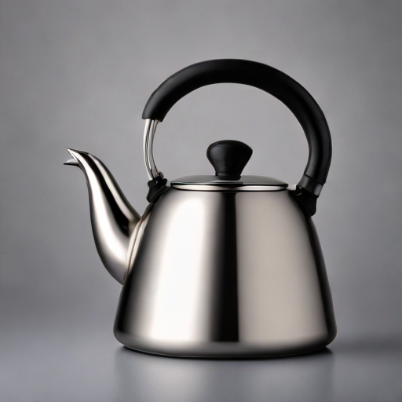
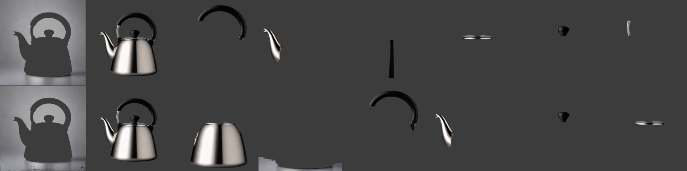
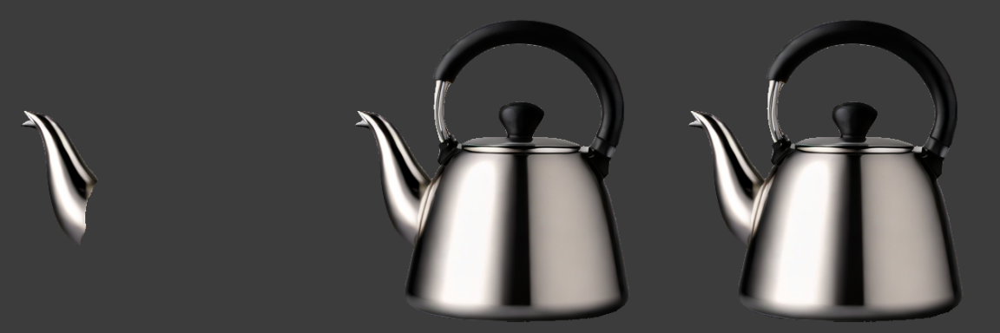
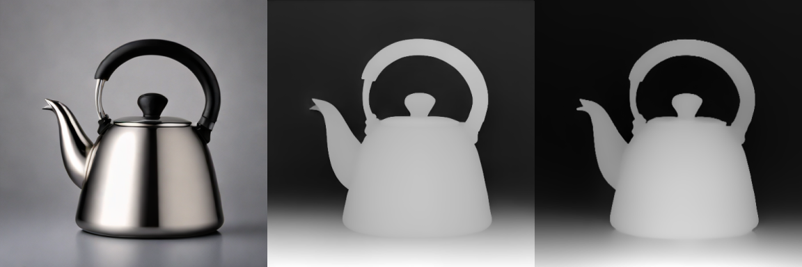
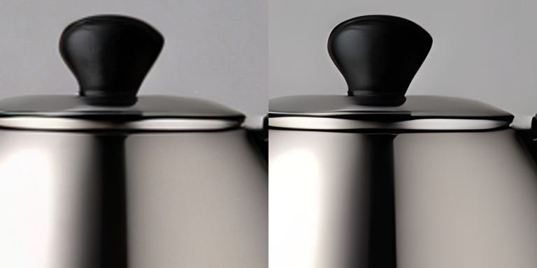
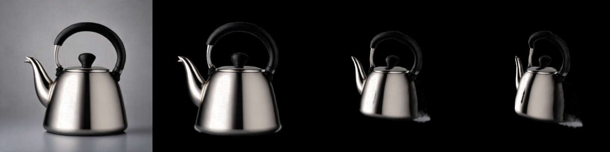
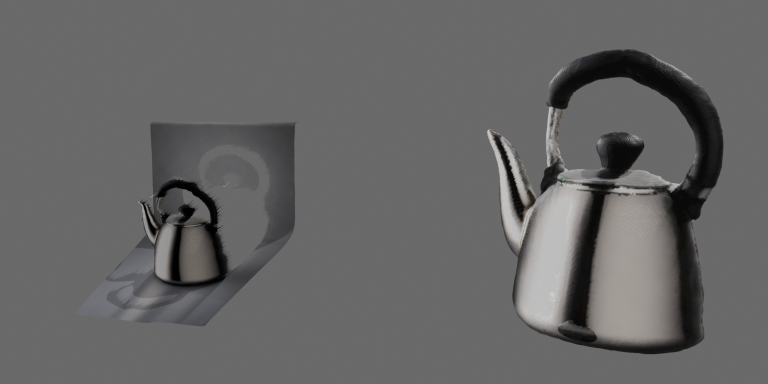

# Walkthrough

One image goes through every stage of `splat`: a diffused kettle becomes a caption, an embedding, stickers, depth maps, a sharper image, a Gaussian splat, renders, meshes and exports. Every number and picture below comes from running these commands in order, on an M-series Mac with the weights already downloaded (first use of a model downloads it, which takes minutes).

Each command stores its output as a manifest in the cache and prints one NDJSON record when piped. `-o` also writes the file, with a `.manifest.json` sidecar so the lineage travels with it. Later commands take a file path, an `@<manifest-id>`, or `-` for piped records.

## 1. Diffuse

```sh
splat diffuse "a single stainless steel kettle with a black handle, centered, plain mid-gray studio backdrop, soft even lighting, 3/4 view" --seed 4 -o kettle.png
```



The default model is `sdxl-turbo-mlx`, which renders 512 px in a few seconds. Its license is non-commercial, and `splat` prints that on every run. A plain backdrop and a single centred subject matter: every later stage does better on an image like this, and the rest of this page keeps using this one file.

## 2. Caption and embed

```sh
splat caption kettle.png -o caption.txt
splat embed kettle.png -o kettle.npy
```

The caption is `A shiny silver tea kettle with a black handle.` (`fastvlm-0.5b`, a `caption` manifest of 46 characters). The embedding is a normalized 512 dimensional float32 vector from `mobileclip2-s0`, stored as `.npy`. `embed --text "..."` produces the same kind of vector for a text query, and a dot product compares two of them.

## 3. Segment

```sh
splat segment kettle.png --model sam-mlx --max-stickers 8 -o stickers/
splat segment kettle.png --model sam2-coreml --max-stickers 8 -o stickers/
```



Automatic segmentation fans out into one RGBA `sticker` per mask, largest first. The first cell of each row is the frame sized mask (shown as the backdrop with the kettle cut out), and the floor strip is another background mask. One mask is the whole kettle; the rest are parts: handle, spout, lid, knob, body. `--drop-background` removes the masks that cover most of the frame or span part of its edge.

To say which object you mean, prompt the model instead:

```sh
splat segment kettle.png --point 140,225 -o spout.png
splat segment kettle.png --box 70,60,440,465 -o kettle-box.png
splat segment kettle.png --foreground -o kettle-cutout.png
```



`--point x,y` (and `--not-point x,y` for background, both repeatable) and `--box x0,y0,x1,y1` take pixel coordinates in the source image and return one sticker. `--foreground` needs no prompt: it finds the box around the masks that are not background and box-prompts the model with it, which gives one clean cutout with the handle opening left open. `sam-mlx` and `sam2-coreml` return the same box on this image, `(83, 75, 346, 381)`, give or take a pixel. `sam2-coreml` takes a box or up to two points, because its converted prompt encoder takes exactly two.

A sticker is a tight crop. Its `bbox` in the manifest places it back in the source image, which is how a sticker works as a mask for the next stages.

## 4. Depth

```sh
splat depth kettle.png --model depth-pro -o depth-pro.png
splat depth kettle.png --model depth-anything-v2-coreml -o depth-anything.png
```



`depth-pro` is metric: the `depth_map` is in metres and records the focal length (1846 px, a 15.8 degree field of view). `depth-anything-v2-coreml` is faster but only relative disparity, with no focal length. Both are cached losslessly as `.npy`, and `-o` writes a viewable PNG of them. Only the metric one can become geometry, and `mesh` says so if you hand it the other:

```text
error: heightfield needs metric depth in metres, but 69163aee51908296 is relative disparity (depth:depth-anything-v2-coreml); use a metric model such as depth-pro.
```

## 5. Upscale

```sh
splat upscale kettle.png -o kettle-x4.png
```



`realesrgan-mlx` makes a 2048 px `image` out of the 512 px one, and the result is an ordinary image manifest that any stage can take.

## 6. Gaussian splat

```sh
splat gaussian kettle.png --score -o kettle.ply
```

`sharp` reconstructs a Gaussian splat from the single image: 1,179,648 Gaussians, an 80 MB `.ply` in the OpenGL convention (+Y up), SH degree 0, in metres. It takes about 16 s here. `--score` renders source view 0 with Blender and records the comparison against the photo in the cloud's `quality`: PSNR 36.51 and SSIM 0.9671, plus floater statistics. `splat manifest get <id>` prints them.

A single photo has a backdrop, and SHARP reconstructs that too, as a wall behind the subject. Hand `gaussian` the cutout from step 3 and it keeps only the Gaussians that project inside it:

```sh
splat gaussian kettle.png --mask kettle-cutout.png -o kettle-masked.ply
```

That is 343,100 Gaussians, a 23 MB file. Gaussians that project inside the mask but sit more than half a subject size behind its nearest surface are dropped too, since they belong to the wall in line with the subject. The masked cloud is a cached child of the full one, so changing the mask does not repeat the reconstruction.

## 7. Render

```sh
splat render kettle.ply -o full.png
splat render kettle-masked.ply -o view0.png --view 0
splat render kettle-masked.ply -o orbit.png --azimuth 25 --elevation 8
splat render kettle-masked.ply -o side.png --azimuth 45 --elevation 8
```



`render` runs Blender (set `SPLAT_BLENDER_BIN` if it is not on `PATH`) and produces an `image` manifest. By default it frames the whole cloud, which is why the backdrop wall makes the kettle small in the first cell. `--view 0` renders from the source camera and reproduces the photo. Orbiting shows the limit of one image: SHARP only knows the visible side, so the kettle gets thin as you turn away. `--zoom` scales the framing independent of the cloud's units (`1` fits the subject, `2` is twice as close), `--distance` is absolute in the cloud's units, and `--fov` and `--look-at x,y,z` adjust the rest.

## 8. Mesh

```sh
splat mesh @<depth-pro-id> -o relief.glb
splat mesh kettle-masked.ply -o kettle.glb
```



`mesh` has two paths. A metric depth map becomes a textured heightfield, a relief of everything in the photo (262,144 vertices, 515,829 faces, 11.7 MB). A Gaussian cloud becomes an isosurface of its density field with per-vertex colours (77,832 vertices, 155,588 faces, 3.1 MB), which is the kettle alone because the backdrop was masked out. Both are `shape_3d` manifests with typed counts, written as `.glb`, `.obj`, `.ply` or `.gltf` by the extension.

## 9. Export

```sh
splat export kettle-masked.ply -o kettle.spz
splat export kettle-masked.ply -o kettle.web.splat --profile web-delivery
```

`export` writes any manifest in the format of the extension, with a sidecar. For the masked cloud: `.ply` 23.3 MB, `.spz` 3.4 MB, `.web.splat` 11.0 MB (342,992 points after compression). `splat validate kettle-masked.ply --strict` checks a cloud's invariants and `splat info` prints its count, SH degree, bounds and cameras.

## Lineage

Every output remembers its parents, so `splat manifest get <id>` on the mesh shows how it was made, down to the prompt, with each model's license:

```text
c6942b0ba8451acd  shape_3d  mesh:isosurface
└── 257ac7c3f0d115c0  gaussian_cloud  mask
    ├── cdb0a214b4ab2afd  gaussian_cloud  gaussian:sharp  Apple-ML-Research
    │   └── 6e4bc802376678d7  image  diffuse:sdxl-turbo-mlx  StabilityAI-NC-Community
    └── 5a27b3a26ccc1d45-000  sticker  segment:sam-mlx  Apache-2.0
        └── 6e4bc802376678d7  image  diffuse:sdxl-turbo-mlx  StabilityAI-NC-Community
```

Re-running any command with the same inputs is a cache hit. `splat manifest list`, `get`, `export`, `rm` and `gc` manage the cache.

## Not in this flow

`gaussian --model mlx3d-capture` is the multi-view path. It needs three or more genuinely overlapping photos of one scene, so it has no place in a single-image walkthrough. Several independently generated images do not satisfy that.

## Debug loop

1. Find ids with `splat manifest list`.
2. Read parameters, model, license and lineage with `splat manifest get <id>`.
3. Check a cloud with `splat info` and `splat validate`.
4. Look at it with `splat render`.

When output looks wrong, read the metadata before rerunning a heavy stage: parent ids, effective parameters, depth units, camera count and coordinate convention explain most surprises.
