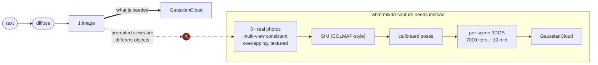
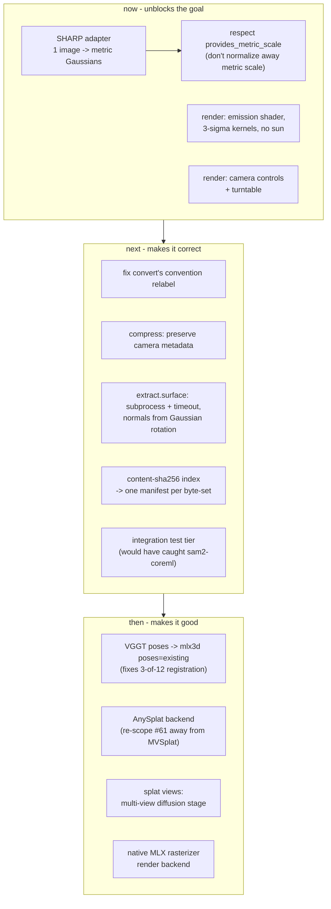

# Closing the gap: research and proposed backends

[gaps.md](gaps.md) identifies one gap that matters more than all the others: `splat` cannot get from an image to a Gaussian splat. This document surveys what exists to fix that, and proposes concrete adapters that fit `splat`'s existing shape.

## The gap, precisely stated



There are exactly three ways across, and they are complementary rather than competing.

| Route | Shape | Fixes | Cost |
|---|---|---|---|
| **A. Single-image feed-forward** | 1 image -> Gaussians, one forward pass | the gap, directly | one adapter |
| **B. Multi-view diffusion bridge** | 1 image -> N consistent views -> existing `gaussian` | the gap, indirectly; also gives real orbit views for `render` | one stage + slow reconstruction |
| **C. Learned pose/geometry front-end** | N unposed images -> poses + points, replacing SfM | the 3-of-12 registration failure on *real* captures | one adapter, big quality win |

Route A is the answer to "diffuse an image and chain it to a splat". Routes B and C are what make the result good.

---

## Route A - `apple/Sharp` (recommended, do this first)

**SHARP** (Apple, arXiv:2512.10685, Dec 2025) regresses the parameters of a 3D Gaussian representation from **a single photograph** in one feed-forward pass, under a second on a standard GPU. It reports 25-34% lower LPIPS and 21-43% lower DISTS than the best prior model while cutting synthesis time by three orders of magnitude.

It is close to a perfect fit for `splat`, on five independent axes:

| Requirement | SHARP |
|---|---|
| Runs on Apple Silicon | Prediction supports **CPU, CUDA and MPS**. `torch>=2.5` is already a `splat` dependency. |
| Output format | Standard 3DGS `.ply` - `PlyReader` already reads it |
| Coordinate convention | **OpenCV/COLMAP** (x right, y down, z forward) - exactly `splat`'s `coordinate_convention="colmap"` |
| Weights distribution | HF `apple/Sharp`, one file `sharp_2572gikvuh.pt` (2.8 GB). `HuggingFaceModelSource` handles it unchanged. |
| License modelling | `apple-amlr`, and `domain/value_objects.py` **already defines `APPLE_AMLR`** (unused today) |

There is also an MLX conversion already published: **`agg23/Sharp-mlx-f16`**, a fp16 safetensors (1.4 GB) of the same checkpoint intended for Swift/MLX implementations. That is a natural second variant once the torch/MPS path is proven, and halves the download.

One important consequence, and it needs a decision rather than a default: **SHARP's representation is metric, with absolute scale**, supporting metric camera movements. `run_gaussian` currently calls `normalize_gaussian_cloud(cloud)` unconditionally, which recenters and rescales to a median radius of 1.0 and would **throw away the one thing SHARP uniquely provides**. Normalization exists because SfM and feed-forward reconstruction have no absolute scale; SHARP does. The backend should be able to declare that.

### Proposed implementation

Fits the existing pattern with no new architectural concepts:

```
ports/reconstruction.py          # unchanged, add optional `provides_metric_scale: bool` to the Protocol
registry/gaussian.py             # + catalog entry
adapters/gaussian/sharp.py       # + new adapter
application/pipeline.py          # respect provides_metric_scale in run_gaussian
```

```python
# registry/gaussian.py
"sharp": GaussianModelDescriptor(
    name="sharp",
    backend_cls=SharpBackend,
    hf_repo_id="apple/Sharp",
    license=APPLE_AMLR,              # already defined, currently unused
    runtime="torch",
    notes=(
        "Apple SHARP: single-image feed-forward 3DGS, metric absolute scale, "
        "OpenCV/COLMAP convention. Sub-second on MPS. Research/non-commercial."
    ),
),
```

```python
# adapters/gaussian/sharp.py
class SharpBackend:
    name = "sharp"
    provides_metric_scale = True     # run_gaussian must NOT normalize this

    @classmethod
    def required_image_count(cls) -> tuple[int, int | None]:
        return (1, 1)                 # the whole point

    def reconstruct(self, images, *, device="auto", **params) -> GaussianCloud:
        ...
```

`required_image_count() == (1, 1)` flows automatically into `gaussian`'s per-request `StageContract`, so `splat diffuse "..." | splat gaussian - --model sharp` type-checks with no contract changes. That is the ports-and-adapters design paying off.

Two integration choices to make deliberately:

1. **In-process torch versus subprocess.** The reference distribution is a `sharp` CLI (`sharp predict -i <dir> -o <dir>`) built for Python 3.13 + conda + its own `requirements.txt`; `splat` is on Python 3.12 with pinned `transformers` and `coremltools`. If the dependency set conflicts, wrap the CLI as an external-process adapter, the same shape `adapters/render/blender.py` already uses (`_resolve_blender_bin` + `subprocess.run`, and give this one a `timeout`). If the model can be loaded directly from the checkpoint, in-process MPS is better: no temp directories, no CLI contract to track.
2. **The `--render` flag is CUDA-only** in the reference repo and is irrelevant here; `splat` renders through its own `render` command.

### What this unlocks immediately

```sh
splat diffuse "a small red toy robot, studio lighting" | splat gaussian - --model sharp -o robot.ply
splat tools declutter robot.ply robot.clean.ply
splat render robot.clean.ply -o robot.png
```

That is the chain, end to end, in three commands and a few seconds instead of ten minutes and a failure.

---

## Route B - multi-view diffusion as a bridge stage

Rather than replacing reconstruction, make `diffuse`'s output usable by the reconstruction that already exists. A multi-view diffusion model takes one image and produces N *3D-consistent* views around it, which is precisely what §7 of [pipeline.md](pipeline.md) shows prompting cannot do.

| Model | Output | License | Notes |
|---|---|---|---|
| **Zero123++** (`SUDO-AI-3D/zero123plus`) | 6 fixed views, one 960x640 tiled image | Apache-2.0 (code) | The pragmatic pick: a plain diffusers pipeline, small, runs on MPS, v1.2 open |
| **SV3D** (Stability) | 21-frame orbit via latent video diffusion | StabilityAI non-commercial | Best orbit quality; same license class as the already-cataloged `sdxl-turbo-mlx` |
| **MV-Adapter** (arXiv:2412.03632) | adapter over an existing T2I base | Apache-2.0 | Attractive because it *reuses* `splat`'s existing SD/SDXL weights rather than adding a 5 GB model |
| **Era3D** (arXiv:2405.11616) | high-res multiview, row-wise attention | check directly | Higher resolution, heavier |

`MV-Adapter` deserves a serious look specifically for this codebase: it is an adapter on a text-to-image base, so it composes with the diffusion weights `splat` already pulls, instead of introducing a parallel model stack.

This route is worth having even with Route A shipped, because it produces *actual novel views*, which are useful for evaluation, for `tools normalize.color`'s cohort correction, and as ground truth for judging a SHARP reconstruction.

Surface: a new stage `splat views` (model-backed, `--model zero123pp|sv3d`), 1 `colorlike` in, N `image` manifests out. It is the same fan-out shape `segment` already implements, so `run_segment`'s children-plus-marker mechanism is the precedent, ideally with G15's marker-kind fix applied first.

---

## Route C - replace SfM with a learned geometry front-end

This fixes a different and equally real failure: on genuinely multi-view input, `mlx3d-capture`'s SfM registered **3 of 12 images** ([pipeline.md §7](pipeline.md)). Classical SfM is brittle on sparse, low-texture, or wide-baseline captures. The 2025-2026 answer is to regress geometry and poses directly.

| Model | What it gives | License | Fit |
|---|---|---|---|
| **VGGT** (`facebookresearch/vggt`, CVPR'25 Best Paper) | poses + intrinsics + dense points from N unposed images, one forward pass | code commercial-friendly since 2025-07-29; **`facebook/VGGT-1B` is non-commercial, `facebook/VGGT-1B-Commercial` is commercial (gated form)** | Plain transformer, no custom CUDA kernels. Best pose front-end available. |
| **AnySplat** (`InternRobotics/AnySplat`, SIGGRAPH Asia'25 / ACM TOG) | Gaussians **and** poses from unconstrained unposed views | **MIT**, weights `lhjiang/anysplat` | Importable `AnySplat.from_pretrained()`. Distills VGGT priors, so no SfM/MVS supervision needed. Differentiable voxelization removes 30-70% redundant primitives. Depends on `gsplat`, so confirm whether the *forward* pass needs its CUDA kernels or only the training loop does. |
| **MASt3R / DUSt3R** (Naver) | dense matching + poses | Naver **non-commercial** research license | Strong, but the license class matters here |
| **PF3plat** (ICML'25) | pose-free feed-forward 3DGS | check directly | Reports SOTA across pose-free benchmarks |

Two ways to use this:

- **As a pose provider for `mlx3d-capture`.** VGGT emits poses; `mlx3d`'s `CaptureConfig` already accepts `poses="colmap"|"existing"`. Writing VGGT poses out as a COLMAP sparse model and passing `poses=existing` replaces the brittle step while keeping the working optimizer. Cheapest high-value change on this list after Route A.
- **As a complete replacement.** AnySplat is a single MIT-licensed model producing both Gaussians and poses from unposed images, which is `gaussian`'s entire contract in one forward pass. If its Gaussian prediction runs without CUDA kernels, it is a stronger `mvsplat` replacement than MVSplat, which per issue #61 needs calibrated poses `splat` cannot supply and ships only as a Hydra/Lightning research framework.

**Recommendation for issue #61:** re-scope it. MVSplat needs pose input `splat` has no way to produce; AnySplat needs none, is MIT, and has an importable inference entry point. The feed-forward multi-view slot should be filled by AnySplat, and #61 should say so.

---

## The renderer

Route A gives a splat. G2/G3 mean `splat` still cannot show it. Two tracks:

### Fix the Blender path (small, high value)

The current script is 165 statements at 0% coverage. The changes are contained:

| Change | Why |
|---|---|
| `ShaderNodeEmission` (or volume) with `Alpha = opacity`, delete the `SUN` | 3DGS is emissive alpha compositing; a `Principled BSDF` under a sun makes every colour a lighting response |
| Scale kernels by ~2.5-3x, raise `subdivisions`, or instance a Gaussian-textured billboard | a 1σ hard ellipsoid at `subdivisions=1` is why the render is faceted shards |
| `--azimuth / --elevation / --distance / --fov / --look-at / --background` | there is currently no way to choose a viewpoint |
| `--frames N` turntable, writing an `image` manifest per frame | "present this nicely" means an orbit, not one still |
| `distance = max(percentile(radii, 95), median) * k` | `median * 4.0` puts the camera inside the cloud |
| Use **all** camera poses, not `cameras[0]` | `cameras[0]` is the world origin by construction, so its rotation is always identity |
| Surface Blender's log under `-v`; add a `subprocess` timeout | currently discarded on success, and can hang forever |
| Golden-image test | render 100 known Gaussians, compare to a committed PNG within tolerance |

Blender GPU is already correct: `_enable_gpu_compute` selects Metal and sets `scene.cycles.device = "GPU"`, verified live. (The `device.type in (backend, "CPU") and device.type != "CPU"` expression simplifies to `device.type == backend`; the `"CPU"` term is dead and should go, but the behaviour is right.)

### Add a real rasterizer backend

`registry/render.py` explicitly anticipates this: *"there is exactly one render backend (blender) today... add one if/when a second backend (e.g. a native mlx3d/gsplat rasterizer) shows up."* A true differentiable/EWA-splatting rasterizer gives correct, fast previews; Blender then becomes the *presentation* backend for composited, lit, art-directed stills rather than the only way to see anything. `gsplat-mlx` (Apache-2.0, surveyed in issue #62) and `mlx3d`'s own rasterizer are the candidates, and `mlx3d` is already a hard dependency.

The right division of labour: `--model rasterizer` for fast correct previews and turntables, `--model blender` for beauty renders with real shadows, depth of field, and scene composition.

---

## License summary

Issue #70 asks for exactly this table for the Gaussian-splat ecosystem. For the models named here:

| Method | Code | Weights | Verdict for `splat` |
|---|---|---|---|
| **SHARP** | Apple dual-license (see `LICENSE`) | `apple-amlr` | **Catalog as `APPLE_AMLR`** - same class as the already-cataloged `fastvlm-0.5b` and `mobileclip2-s0`. Non-commercial, warned at invocation. |
| **AnySplat** | MIT | `lhjiang/anysplat` | Clean. Preferred feed-forward multi-view backend. |
| **VGGT** | commercial-friendly since 2025-07-29 (no military) | `VGGT-1B` non-commercial; **`VGGT-1B-Commercial`** commercial, gated form | Usable; catalog the commercial checkpoint and note the gate |
| **Zero123++** | Apache-2.0 | open | Clean |
| **MV-Adapter** | Apache-2.0 | open | Clean, and reuses existing SD weights |
| **SV3D** | Stability non-commercial | non-commercial | Same class as `sdxl-turbo-mlx`, already precedented |
| **MASt3R / DUSt3R** | Naver non-commercial | non-commercial | Flag before adopting |
| **MVSplat** | MIT | `dylanebert/mvsplat` MIT | Clean, but needs poses `splat` cannot produce |
| **gsplat-mlx** | Apache-2.0 | n/a | Clean |
| **Brush** | Apache-2.0 | n/a | Clean, external process |
| **OpenSplat** | **AGPL-3.0** | n/a | Needs an explicit decision even as a subprocess dependency |

`ModelLicense` handles all of this already. That early investment is now paying for itself.

---

## Suggested sequencing



The top box is the difference between a tool that cannot do the thing and a tool that can. Everything below it is the difference between doing the thing and doing it well.

---

## Sources

- [SHARP - apple/ml-sharp](https://github.com/apple/ml-sharp) · [apple/Sharp weights](https://huggingface.co/apple/Sharp) · [agg23/Sharp-mlx-f16](https://huggingface.co/agg23/Sharp-mlx-f16) · [coverage](https://www.creativebloq.com/3d/apples-sharp-can-turn-a-photo-into-a-3d-scene-in-under-a-second)
- [AnySplat - project page](https://city-super.github.io/anysplat/) · [code](https://github.com/InternRobotics/AnySplat) · [paper](https://arxiv.org/html/2505.23716v1) · [ACM TOG](https://dl.acm.org/doi/abs/10.1145/3763326)
- [VGGT - facebookresearch/vggt](https://github.com/facebookresearch/vggt) · [VGGT-1B-Commercial](https://huggingface.co/facebook/VGGT-1B-Commercial) · [VGGT-1B](https://huggingface.co/facebook/VGGT-1B)
- [PF3plat - pose-free feed-forward 3DGS (ICML'25)](https://icml.cc/virtual/2025/poster/45052)
- [Advances in Feed-Forward 3D Reconstruction and View Synthesis: A Survey](https://arxiv.org/pdf/2507.14501)
- [Multi-Layer Gaussian Splatting for Single-Image Feed-Forward Reconstruction (ACM MM'25)](https://dl.acm.org/doi/10.1145/3746027.3755176)
- [Zero123++](https://github.com/SUDO-AI-3D/zero123plus) · [MV-Adapter](https://arxiv.org/pdf/2412.03632) · [Era3D](https://arxiv.org/pdf/2405.11616) · [SV3D](https://venturebeat.com/ai/stability-ai-brings-a-new-dimension-to-video-with-stable-video-3d)
